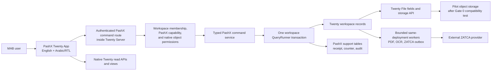
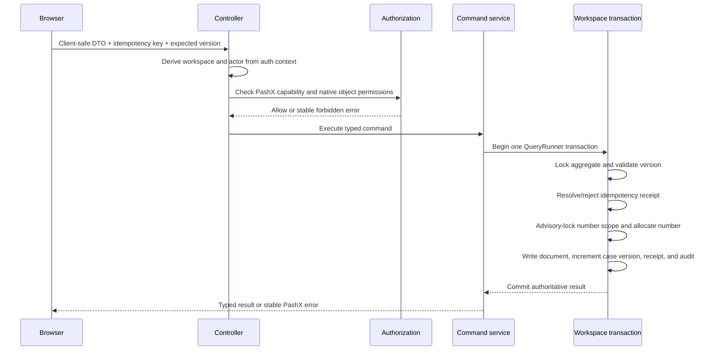

# PashX MAB Architecture Overview

- Status: pilot baseline
- Updated: 2026-08-06
- Deployment: one dedicated MAB deployment and one Twenty workspace
- Product plan: `/Users/shahilmoideen/.gstack/projects/PachXX-twenty/shahilmoideen-main-design-20260804-021900.md`
- UI contract: [`DESIGN.md`](../../DESIGN.md)
- Transaction decision: [`ADR 0001`](decisions/0001-pashx-workspace-transaction-boundary.md)

## Context and goals

PashX MAB is a procurement-to-cash pilot built on the forked Twenty CRM. It must let MAB staff demonstrate and audit two complete transaction chains while keeping document numbers, money, lifecycle transitions, permissions, and audit history deterministic.

This architecture optimizes for a trustworthy single-customer pilot. Multi-tenancy, industry packs, subscription billing, generalized ERP functionality, and a separately operated domain service are explicitly deferred until MAB acceptance provides evidence for them.

## System boundary

The browser never supplies a trusted workspace ID or actor ID. Twenty authentication supplies both. All business mutations pass through typed PashX commands; native Twenty APIs and views remain the default read path.

## Deployable units

| Unit                            | Responsibility                                                                                                      | Pilot rule                                                                      |
| ------------------------------- | ------------------------------------------------------------------------------------------------------------------- | ------------------------------------------------------------------------------- |
| Twenty web application          | Authentication shell, navigation, records, tables, boards, side panels, localization, and PashX front components    | Extend through the PashX app boundary; avoid a second dashboard                 |
| Twenty Server with PashX module | Authentication, authorization, command orchestration, transactions, calculations, numbering, idempotency, and audit | One deployable for the pilot; no separate domain service                        |
| PostgreSQL                      | Twenty core/workspace data and PashX workspace support tables                                                       | Financial command writes share one workspace transaction                        |
| Object storage                  | Source and generated document bytes                                                                                 | Use Twenty File/storage conventions; provider is frozen only after Gate 0 tests |
| Same-deployment bounded workers | PDF generation, benchmark-approved OCR, and ZATCA outbox processing                                                 | External work never executes inside the financial transaction                   |

Redis is included only if the selected Twenty deployment requires it. Durable pilot state must not depend on the application VM filesystem.

## Source layout and ownership

| Path                                            | Purpose                                                                                                |
| ----------------------------------------------- | ------------------------------------------------------------------------------------------------------ |
| `packages/pashx-mab-contract/`                  | Framework-free stable identifiers, enums, DTOs, errors, and runtime request validation                 |
| `packages/twenty-apps/pashx-mab/`               | App metadata, roles, permissions, custom objects, command actions, and PashX presentation              |
| `packages/twenty-server/src/modules/pashx-mab/` | Authenticated command routes, authorization, transaction application services, and support persistence |
| `docs/architecture/`                            | Current system overview and accepted architecture decisions                                            |
| `DESIGN.md`                                     | Approved UI implementation contract and production visual-quality gate                                 |

Business behavior stays server-side. The contract package contains no React, NestJS, database, storage, calculation, transition, OCR, or ZATCA client logic.

## Pilot data model

Twenty standard Company records represent customers and suppliers and will gain a `partyRole` classification. Four PashX custom objects form the pilot model:

1. **Procurement Case** — the aggregate and visible deal/pipeline unit.
2. **Commercial Document** — RFQ, vendor quote, customer quote, customer/vendor PO, delivery note, invoice, and correction document through a typed discriminator.
3. **Document Line** — quantity, unit price, tax/discount inputs, and deterministic totals.
4. **Expense** — approved direct expenses attributed to the case.

Deals Kanban is a view of Procurement Cases, not a second object. Underlying records remain authoritative; case and dashboard screens link to them instead of copying editable state.

Money is stored as Twenty Currency values with canonical integer micros and ISO 4217 currency codes. The server performs calculations with integer/BigInt arithmetic, applies named rounding boundaries, and converts only at verified persistence/API edges. Arabic display uses locale-aware formatting; ZATCA payloads use exact decimal strings.

## Write path and transaction invariants

The current vertical slice is `POST /rest/pashx-mab/vendor-purchase-orders`.

Required invariants:

- Identical idempotent replay returns the stored authoritative result.
- Reusing a key with a different payload is rejected.
- A stale expected version is visible and never overwrites newer work.
- Document numbering is serialized by workspace, document type, and period, with a unique constraint as the final guard.
- Any failure rolls back the record, number, version, receipt, and audit together.
- Support tables live in the workspace schema so these writes share the same connection and transaction as workspace records.

`MAB-VPO-{calendar year}-{four-digit sequence}` is provisional for the spike. Gate 0 must freeze the production prefix, period, rollover, VAT, discount, delivery, rounding, and margin rules.

## Authorization and trust boundaries

Every command requires all of the following:

1. An authenticated Twenty workspace member.
2. The command-specific PashX capability.
3. Native Twenty object permissions for each affected record type.
4. Server validation of the command and current aggregate state.

The UI may hide or disable unavailable actions, but it is never the authorization boundary. Workspace identity, actor identity, authoritative totals, versions, numbers, lifecycle state, and compliance state are server-owned.

## Documents, OCR, and ZATCA

Twenty owns file upload, stable references, access checks, preview/download, and attachment behavior. The pilot adds only the document metadata, checksums, versions, immutable artifacts, and audit evidence that the business workflow requires.

OCR is optional Week 2 acceleration:

- Extract digital PDF text first.
- Benchmark 30–50 representative English/Arabic pages before integration.
- Prefer PaddleOCR/PP-StructureV3 as the primary free structured-document candidate; compare OpenOCR and EasyOCR only through evidence.
- Run accepted OCR in a bounded asynchronous worker.
- Store extracted fields as proposals with confidence and source coordinates.
- Require side-by-side human review before proposals change financial or workflow records.

ZATCA integration sits behind an `InvoiceComplianceProvider`. Finalization creates an immutable invoice snapshot and outbox item in the same database transaction. A bounded worker performs UBL/signature/QR/reporting or clearance outside that transaction and records append-only attempts. Business lifecycle and ZATCA lifecycle remain separate and visible.

## Read model, dashboards, and AI

Native Twenty views serve ordinary record reads. Purpose-built bounded queries may serve the case workspace, Command centre, and Operational profitability dashboard when they require cross-record aggregates.

Profitability is deterministic: finalized customer-invoice revenue minus finalized vendor costs and approved direct expenses. Aggregates expose period, currency treatment, filters, inclusion rules, as-of time, and drill-through records.

AI can narrate deterministic trends and anomalies only. Each insight must link to its records, formula, filters, and generation time. AI cannot calculate authoritative money, change stages, approve, assign, issue documents, submit to ZATCA, or create audit truth.

## Planned Autopilot and Operations Inbox

The next product layer is a canonical Operations Inbox and deterministic workflow control plane. WhatsApp, email, web forms, uploaded PDFs/Excel, voice notes, and mobile photos enter through channel adapters and become one durable inbox-item contract. Bounded AI calls classify supported items, extract document proposals, rank master-data matches, and recommend an allowlisted next action. Typed validation, approval policy, authorization, idempotent commands, provider outboxes, exception handling, and audit remain application-owned.

The demo proves one complete intake → reviewed extraction → match → recommendation → approval → command → audit path. It also shows the full Request → Quote → Approval → Purchase Order → Confirmation → Delivery → Receipt → Invoice → Payment rail with current stage, owner, age, blocker, and next action. A channel is labelled live only after a real signed webhook/round-trip test; otherwise it remains visibly planned.

Production email/WhatsApp, voice transcription, supplier follow-up automation, broader workflow templates, and advanced exception rules follow after the demo. BOQ quantity conflict, purchase-order overrun, claims, and project-delay-risk automation are explicitly post-demo. The detailed proposed decision is [`ADR 0002`](decisions/0002-pashx-autopilot-workflow-control-plane.md).

## Deployment and operations

The pilot baseline is one reproducible application VM running Docker Compose, Cloud SQL PostgreSQL, and approved object storage. GitHub Actions runs lint, typecheck, tests, container build, and migration checks before a manually approved deployment.

The VM is replaceable. Target RTO is four hours and RPO is five minutes. Cloud SQL point-in-time recovery, object versioning, secrets management, health checks, backups, and a rehearsed restoration runbook are acceptance requirements.

The authoritative integration environment is the dedicated MAB pilot environment in Google Cloud, not a developer laptop. During development it contains only disposable pilot/test data and a dedicated test workspace or database boundary; destructive concurrency and rollback tests must never target accepted production records. Local checks remain useful for fast feedback, but local disk capacity does not block provisioning or validating the Google Cloud environment.

PashX emits the OpenTelemetry histogram `pashx/financial-command/internal-duration-ms` around the internal financial-command boundary. Its explicit buckets include 1,000 ms and its attributes are limited to command, document type, outcome, and replay state. External OCR, ZATCA, storage-provider, and other network calls must remain outside this timer. Cloud Monitoring owns the p95 aggregation and rollback alert; Cloud SQL slow-query logging and Query Insights remain supporting database diagnostics, not substitutes for the application metric.

## Architecture decisions and trade-offs

- **Workflow before agent:** the business path is defined and auditable; no autonomous agent owns financial or workflow control flow.
- **Bounded Autopilot:** AI may classify, extract, match, and recommend; the workflow engine owns control flow and only approved allowlisted actions reach typed commands.
- **One pilot deployable:** lowers operational and schedule risk; future services require evidence.
- **App boundary before core fork changes:** reduces the upstream diff while retaining a narrowly isolated server command seam.
- **Workspace-local support persistence:** enables atomicity but requires install reconciliation, backup, restore, and future deletion handling.
- **Asynchronous external providers:** prevents slow or unreliable OCR/ZATCA calls from corrupting financial transactions, at the cost of explicit pending/retry states.
- **Single-customer first:** avoids premature tenancy and industry-pack abstractions; accepted behavior can later become a versioned blueprint.

## Current implementation status

As of 2026-08-05, T2 is complete and the T3 Vendor PO source slice is implemented. Contract tests, contract/app lint and typecheck, focused immutable installation, and the official PashX app build pass. T3 is not complete until server typecheck, PostgreSQL concurrency/rollback tests, support-table install reconciliation, installed-app smoke, and browser-to-database E2E pass.

The workstation currently has approximately 2.4 GB free, and a local full-server dependency focus stopped safely with `ENOSPC`. This blocks only the optional local full-server verification path. Claude Code owns the reproducible Google Cloud pilot setup and cloud integration environment; cloud typecheck/build, PostgreSQL tests, install reconciliation, smoke, and E2E provide the authoritative evidence.

## Change rule

Update this overview when a system boundary, deployable unit, trust boundary, source ownership rule, or external integration changes. Add or amend an ADR when the reason or trade-off matters independently. Keep daily execution status in `docs/execution/` rather than turning this overview into a progress log.
