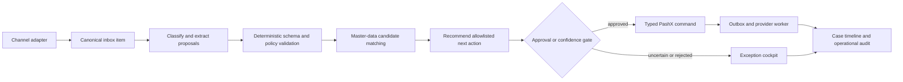

# ADR 0002: PashX Autopilot Uses a Workflow Control Plane

- Status: Proposed
- Date: 2026-08-06
- Deciders: Shahil Moideen, PashX product and engineering
- Scope: MAB pilot expansion after the current Vendor PO vertical slice

## Context

PashX must consolidate operational requests arriving through WhatsApp, email, web forms, uploaded PDFs, Excel files, voice notes, and mobile photos. It must classify each item, understand supported documents, match extracted information to master data, recommend the next action, request approval when required, execute permitted actions, expose end-to-end status, follow up with suppliers, surface exceptions, and preserve an evidence-complete audit trail.

The financial and procurement paths are mostly enumerable and high consequence. A free-running agent would make control flow, retries, authorization, and audit reconstruction less predictable. External providers are asynchronous and may fail independently. The pilot remains a single MAB deployment and should not introduce a separately operated orchestration platform, message broker, or multi-agent swarm before usage evidence requires one.

## Decision

Use a **deterministic workflow control plane with bounded AI decision nodes**.

The application owns lifecycle state, routing gates, retries, approval policy, action authorization, idempotency, deadlines, and audit. AI performs bounded classification, extraction, candidate matching, and recommendation tasks using structured outputs. AI never directly changes financial truth, approves work, sends a sensitive message, or invents an executable action.

The initial control flow is:

### Pattern composition

- **Routing** classifies inbox items into new request, quote, order confirmation, delivery update, invoice, exception, or approval request. An uncertain/default route always exists.
- **Prompt chaining** performs extract → validate → match → recommend, with programmatic gates between stages.
- **Deterministic workflows/state machines** own RFQ, purchase-order confirmation, delivery tracking, invoice processing, and other operational templates.
- A **bounded ReAct recommender** may be introduced later only for requests whose next action genuinely depends on tool observations. It receives an allowlisted read/tool catalog, maximum steps, time and spend limits, and cannot bypass approval or command authorization.
- No multi-agent architecture is approved. Distinct AI calls are capabilities inside one controlled workflow, not independent agents.

## Component boundaries

| Component | Responsibility | Pilot boundary |
|---|---|---|
| Channel adapters | Verify provider signatures, normalize payloads and attachments, retain provider/thread identifiers | Same deployment; connector-specific credentials remain in Secret Manager |
| Operations Inbox | Canonical item, category, source, sender, received time, attachments, processing state, assignee and linked case | One source of operational work across channels |
| Document understanding | Text-layer extraction first; OCR only when required; structured field/line proposals with confidence and source regions | Human confirmation before authoritative writes |
| Matching service | Deterministic exact/identifier matching followed by ranked fuzzy/semantic candidates | Never silently creates or links master data below threshold |
| Workflow engine | Versioned template, state, prerequisites, timers, approval gates, retries and escalation | PostgreSQL-backed; no new broker for the pilot |
| Policy and approval gate | Capability, native permission, amount/risk threshold, separation-of-duties and channel policy | Server-owned and deny-by-default |
| Action executor | Maps approved actions to existing typed, idempotent PashX commands | No arbitrary tool or SQL execution |
| Provider outbox worker | Sends approved email/WhatsApp actions and handles external retries | External calls remain outside financial transactions |
| Exception service | Creates, deduplicates, assigns, ages and resolves actionable exceptions | Every exception links to evidence and permitted resolution |
| Audit timeline | Append-only receipt, extraction, sources, recommendation, approval, message, command result and record changes | AI explanation is evidence-linked but not audit truth |

## Delivery slices

### Demo-critical slice

Prove one truthful end-to-end path:

1. Intake a web form or uploaded PDF/photo/Excel file into the Operations Inbox.
2. Classify it and extract supported quotation, purchase-order, invoice, or delivery fields as proposals.
3. Match supplier, project/case, purchase order and document context, with human resolution for ambiguity.
4. Recommend one allowlisted next action.
5. Require explicit approval and execute through an existing typed PashX command.
6. Show the full Request → Quote → Approval → Purchase Order → Confirmation → Delivery → Receipt → Invoice → Payment rail, including current stage, owner, age, blocker and next action.
7. Show a basic exception queue and an evidence-complete audit timeline.

The demo may show a connector as live only when its real webhook, signature verification, credential boundary and round-trip evidence pass. Otherwise it is labelled “planned connector”; sample payloads must not be presented as a live WhatsApp/email integration.

### Pilot hardening after the demo

- Production email threading and approved outbound email.
- WhatsApp Business webhook and approved outbound templates after Meta account/number/template access exists.
- Voice-note transcription and mobile-photo quality handling.
- Draft supplier/subcontractor follow-ups for quotations, confirmations, delivery dates, missing documents and project updates; sensitive messages require approval.
- Versioned templates for RFQ coordination, PO creation/confirmation, supplier follow-up, delivery tracking and invoice processing.
- Exceptions for late delivery, price variance, invoice mismatch, missing approval/document and supplier silence.
- Contract, BOQ, site-report and supplier-document extraction benchmarks.

### Post-pilot/productization

- BOQ quantity conflict, purchase-order overrun and project-delay-risk detection.
- Claims management and project-delay escalation templates.
- Evidence-based automation thresholds for low-risk sends or actions.
- Multi-tenant channel isolation and versioned industry workflow packs.
- A separate queue/orchestration service only when measured throughput or isolation requires it.

## Options considered

### Option A: Deterministic workflow control plane with bounded AI nodes

| Dimension | Assessment |
|---|---|
| Complexity | Medium |
| Auditability | High |
| Pilot fit | High |
| Failure containment | High |
| Future extensibility | High through versioned adapters, actions and templates |

### Option B: Single autonomous ReAct agent

| Dimension | Assessment |
|---|---|
| Complexity | Medium initially, high operationally |
| Auditability | Medium-low |
| Pilot fit | Low for financial/communication actions |
| Failure containment | Low without recreating a workflow/policy layer |

Rejected because most branches and permitted actions are enumerable, and unknown loops are not worth the loss of control.

### Option C: Supervisor and specialist multi-agent system

| Dimension | Assessment |
|---|---|
| Complexity | High |
| Auditability | Low-medium |
| Pilot fit | Low |
| Cost and latency | Highest |

Rejected because the pilot does not yet require independent domain agents or nested coordination. Classification, extraction and matching are capability calls inside one transactionally controlled product.

## Guardrails

- Version every workflow template, extraction schema, prompt/model configuration, matching policy and action catalog entry.
- Enforce maximum document size/pages, extraction timeout, matching candidates, workflow retries, follow-up attempts, execution duration and per-item AI spend.
- Store model outputs as untrusted proposals and validate them against typed schemas and deterministic business rules.
- Require human approval for record-changing, financial, supplier/customer-facing, ZATCA and low-confidence actions until acceptance evidence supports a narrower policy.
- Deny unknown actions and tools; every executable action maps to an authenticated typed command with idempotency and expected version.
- Preserve provider message IDs, document checksum, source regions, model/version, confidence, candidate scores, reviewer edits, approver, executor, command receipt and resulting record IDs.
- Redact secrets and unnecessary personal/document content from logs and model telemetry.
- Route uncertainty, exhausted retries, provider failure and policy denial to the Exception Cockpit instead of silently continuing.

## Cost and latency drivers

The primary drivers are document pages, OCR use, classification/extraction calls, candidate count, provider latency and retry count. Intake returns after durable receipt; extraction, matching and provider work are asynchronous. Financial-command latency remains measured separately from OCR and channel providers. The pilot should use one classification/extraction pass plus deterministic validation; evaluator loops and parallel voting are not enabled without benchmark evidence.

## Consequences

- PashX gains a coherent Autopilot product surface without surrendering financial or communication control.
- The same canonical inbox and workflow state can support additional channels and industries later.
- The pilot must implement workflow/version/audit primitives before many connector-specific experiences.
- “Autopilot” initially means recommend, approve, execute and escalate—not unattended autonomy.
- Connector credentials and third-party approval timelines can limit which channels are live in the demo.

## Action items

1. [ ] Freeze the demo’s single reference intake packet, expected extraction, matches, recommendation, approval and command result.
2. [ ] Add canonical Inbox Item, Workflow Instance, Approval, Exception and Communication Attempt contracts without duplicating Twenty records.
3. [ ] Define the versioned action catalog and approval policy matrix.
4. [ ] Extend the PashX UI contract with Operations Inbox, process rail and Exception Cockpit states.
5. [ ] Benchmark supported English/Arabic document types and matching thresholds.
6. [ ] Select which channel connectors have real credentials and acceptance evidence before labelling them live.
7. [ ] Add implementation graph nodes only after the current T3/cloud gate is unblocked or explicitly reprioritized.
