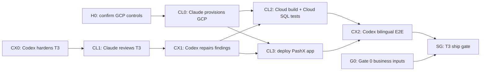

# PashX MAB — Codex + Claude Graph Engineering

- Date: 2026-08-05
- Time zone: Europe/Berlin
- Scope: close T3 and establish the dedicated Google Cloud MAB pilot environment
- Architecture: [`Architecture Overview.md`](../architecture/Architecture%20Overview.md)
- Decision: [`ADR 0001`](../architecture/decisions/0001-pashx-workspace-transaction-boundary.md)
- Diagram source: [`pashx-mab-execution-graph.mmd`](../../diagrams/pashx-mab-execution-graph.mmd)
- Shared agent context: `/Users/shahilmoideen/obsidian-mind-src/work/active/Pashx - MAB Agent Shared Context.md`
- Approved plan: `/Users/shahilmoideen/.gstack/projects/PachXX-twenty/shahilmoideen-main-design-20260804-021900.md`

## Operating model

The dependency graph is the source of truth for coordination. A node becomes `ready` only when every incoming dependency is complete. Independent ready nodes may run simultaneously. Each node uses a bounded internal loop: build, test, review, repair, then publish evidence.

Node states are `blocked`, `ready`, `active`, `review`, `failed`, and `complete`. “Source written” is not complete; the node must satisfy its acceptance contract.

## Current execution graph

## Non-overlap rule

| Owner       | Exclusive paths                                                                                                                                                                                                                                                                                       | Prohibited without handoff                                                                                                                |
| ----------- | ----------------------------------------------------------------------------------------------------------------------------------------------------------------------------------------------------------------------------------------------------------------------------------------------------- | ----------------------------------------------------------------------------------------------------------------------------------------- |
| Claude Code | New `infra/pashx-mab-gcp/`, `deploy/pashx-mab/`, `docs/operations/pashx-mab-gcp/`, `docs/reviews/2026-08-05-claude-t3-review.md`, and new `packages/twenty-server/test/integration/pashx-mab/` files                                                                                                  | PashX production source, contract/app source, existing manifests/lockfile, module registration, architecture, `DESIGN.md`, and `TODOS.md` |
| Codex       | `packages/pashx-mab-contract/`, `packages/twenty-apps/pashx-mab/`, `packages/twenty-server/src/modules/pashx-mab/`, the PashX metric key in `packages/twenty-server/src/engine/core-modules/metrics/types/metrics-keys.type.ts`, required module/package wiring, `docs/architecture/`, and this graph | Claude-owned infrastructure, operations, review, or integration-test files while Claude is active                                         |
| Shahil      | GCP target/cost/domain approval, Gate 0 business decisions, production promotion authority                                                                                                                                                                                                            | Credentials in chat or conflict resolution by deleting either agent's work                                                                |

If Claude finds a production defect, it records the finding; Codex repairs it. If Codex needs an infrastructure change, it records an infrastructure request; Claude implements it. Neither agent crosses the ownership boundary silently.

## Shared-context protocol

Both agents may update the Obsidian shared-context note and PashX roadmap. Before starting or resuming a node, an agent must re-read the graph, shared context, and artifact index. It claims exactly one ready node, edits only its owned paths, and appends a handoff with evidence when the node changes state.

The shared note is a coordination ledger, not a second implementation plan. Agents update only their node row and append-only handoff entry. They do not rewrite another agent's evidence, duplicate an existing artifact, or repeat a passed QA command unless a code, environment, or dependency change invalidates the previous result. The PashX roadmap is updated only for durable milestone/state changes, not every command.

## Root node H0 — Google Cloud controls

- Owner: Shahil, captured by Claude
- State: `complete` (2026-08-06)
- Target project: `pashx-mab-pilot` (`673510652800`) in `me-central1`; `pashxd-e56c5` remains the separate live PashxD product
- Recorded controls: region, provisional hostname, ₹9,000/month budget ceiling, disposable pilot data classification, deploy authority, and lean scheduled sizing
- Safe progress before confirmation: read-only inventory, API/quotas check, architecture plan, cost estimate, IAM design, Terraform validation, and dry-run
- Creation gate: Claude must record the target and cost summary before creating billable resources
- Production gate: no MAB users or accepted production data until SG passes

## Node CL0 — Claude Code: provision the MAB Google Cloud environment

- Priority: first Claude node
- State: `complete` (Claude Code 2026-08-07); live Terraform state reports no changes
- Depends on: H0 for resource apply; read-only discovery and IaC authoring may start immediately
- Exclusive outputs:
  - `infra/pashx-mab-gcp/`
  - `deploy/pashx-mab/`
  - `docs/operations/pashx-mab-gcp/`
- Required infrastructure:
  - One reproducible GCE application VM running the pinned Twenty/PashX containers.
  - Private or tightly restricted Cloud SQL PostgreSQL.
  - GCS document bucket using Twenty's storage boundary.
  - Secret Manager, Artifact Registry, HTTPS/DNS, logs, metrics, and alerts.
  - Redis only when the pinned Twenty deployment requires it.
  - Dedicated least-privilege deployer and runtime service accounts.
  - Cloud SQL automated backups/PITR and GCS object versioning.
  - Disposable workspace/database boundary for destructive T3 tests.
- Acceptance:
  - Infrastructure is reproducible from checked-in configuration.
  - Plan and cost summary are reviewed before apply.
  - No plaintext secrets or durable VM filesystem state.
  - Database is not publicly exposed and only HTTPS is public.
  - Health, authentication, server, worker, database, and storage smoke checks pass.
  - Rollback, teardown, backup, and restore commands are documented.
- Evidence: `docs/operations/pashx-mab-gcp/CL0-provisioning-evidence.md`

## Node CX0 — Codex: T3 cloud-readiness hardening

- Priority: first Codex node, runs simultaneously with CL0
- State: `complete` (Codex 2026-08-07)
- Depends on: existing T3 source
- Exclusive files: Codex production paths listed above
- Work:
  - Audit module registration, configuration, environment assumptions, and error translation for container/cloud execution.
  - Make workspace support-table installation and upgrade reconciliation explicit and idempotent.
  - Confirm support tables participate in backup/restore and do not depend on process memory or local disk.
  - Add focused framework-free tests where they can run without full server installation.
  - Produce an infrastructure contract listing required variables, ports, health checks, storage behavior, migration order, and smoke commands without editing Claude-owned files.
- Acceptance:
  - No workspace or actor identity is trusted from the browser.
  - Support-table reconciliation has a repeatable entry point and idempotency evidence.
  - Startup and health behavior fail visibly when required configuration is absent.
  - Contract/app lint, tests, typecheck, and official app build remain green.
  - Infrastructure contract is published for Claude without secrets.
- Evidence: `docs/execution/evidence/CX0-cloud-readiness.md`

## Node CL1 — Claude Code: independent production review

- State: `complete` (Claude Code 2026-08-07)
- Output: `docs/reviews/2026-08-05-claude-t3-review.md`
- Review: authentication, both permission layers, DTO trust boundary, workspace isolation, one-query-runner transaction, version locks, idempotency, numbering scope, rollback, reconciliation, errors, and log redaction
- Acceptance: each finding includes severity, file/line, evidence, impact, reproduction/reasoning, and repair recommendation; production files remain unchanged

## Node CX1 — Codex: review triage and repair

- State: `complete` (Codex 2026-08-07)
- Work: mark each finding accepted, rejected with evidence, or deferred with owner/reason; repair accepted P0/P1 findings in Codex-owned files
- Acceptance: focused regression tests pass and architecture/ADR changes are recorded when a boundary changes

## Node CL2 — Claude Code: cloud build and Cloud SQL invariants

- State: `ready`; CL0 and CX1 are complete
- Output path: new tests under `packages/twenty-server/test/integration/pashx-mab/`
- Required scenarios:
  1. Both permission layers fail closed independently.
  2. Valid creation writes document, version, receipt, counter, and audit.
  3. Identical replay creates no duplicate writes.
  4. Changed-payload idempotency reuse is rejected.
  5. Stale version is rejected with the current version.
  6. Parallel allocation is unique within a scope.
  7. Workspace, document-type, and period scopes remain isolated.
  8. Injected failure rolls back every write.
  9. Install/upgrade reconciliation is repeatable.
- Acceptance: full cloud server build/typecheck passes and tests use real Cloud SQL transactions through the actual service boundary, not mocks

## Node CL3 — Claude Code: deploy the PashX application

- State: `ready`; CL0 and CX1 are complete
- Work: build the pinned immutable image, deploy it, install the PashX app into the disposable workspace, run migrations/reconciliation, and record the image digest and deployed revision
- Acceptance: authentication, application, worker, database, storage, and Vendor PO smoke checks pass; environment remains restricted to test users

## Node CX2 — Codex: independent cloud QA

- State: `blocked` by CL2 and CL3
- Work: inspect Claude evidence, test the deployed URL, and verify browser-to-database behavior
- Acceptance:
  - English and Arabic/RTL layouts pass.
  - Keyboard operation and 44 px targets pass.
  - Loading, validation, forbidden, stale-version, retry, and success states pass.
  - The created Vendor PO, case version, receipt, number, and audit are inspectable.
  - No hidden retries, disabled assertions, or production data are used.

## Node SG — T3 ship gate

- State: **complete — SHIP internal disposable-data pilot** (2026-08-14)
- Ready only when:
  - No unresolved P0/P1 findings remain.
  - Reproducible provisioning, cloud typecheck, Cloud SQL invariants, reconciliation, installed-app smoke, and bilingual E2E pass.
  - IAM is least privilege; Cloud SQL is not public; secrets, backups/PITR, object versioning, monitoring, rollback, and teardown are proven.
  - The diff is intentional and no pre-existing user work was overwritten.
  - Shahil authorizes commit/push and production promotion.

Decision: all technical dependencies passed and Shahil approved Gate 0 with the recorded residual
risks. Ship is scoped to the internal disposable-data pilot; real-data/general-production promotion
remains a separate gate. See `docs/execution/evidence/SG-ship-decision.md`.

## Deployment rollback triggers

Stop or roll back if authentication or the Vendor PO flow fails; any unauthorized write succeeds; duplicate numbering, stale overwrite, idempotency mismatch, or non-atomic rollback occurs; reconciliation cannot rerun; secrets appear in logs; database connections exhaust; health checks fail for five minutes; application errors exceed 1%; or internal financial-command p95 exceeds one second excluding external providers.

The internal-duration detector is now application-owned: `pashx/financial-command/internal-duration-ms`. Claude owns the follow-up infrastructure node that exports/maps this OpenTelemetry histogram into Cloud Monitoring, computes p95 at the agreed window and sample threshold, configures the one-second alert, and drills it before SG. `log_min_duration_statement=1000` and Query Insights remain secondary evidence only.

## Next actions

1. Claude claims CL1 and writes the independent T3 production review without modifying Codex-owned source.
2. Codex waits for the CL1 artifact, then claims CX1 and triages every finding with evidence before repairing accepted P0/P1 issues.
3. After CX1 completes, Claude runs CL2 and CL3 in parallel where safe; pause the scheduled shutdown for long test/deploy sessions.
4. Claude enables and drills the financial-command p95 policies after the deployed collector emits the first live series.
5. Codex performs CX2; SG decides whether T3 can ship.

No agent starts T4 until SG completes or Shahil explicitly accepts the residual risk.
