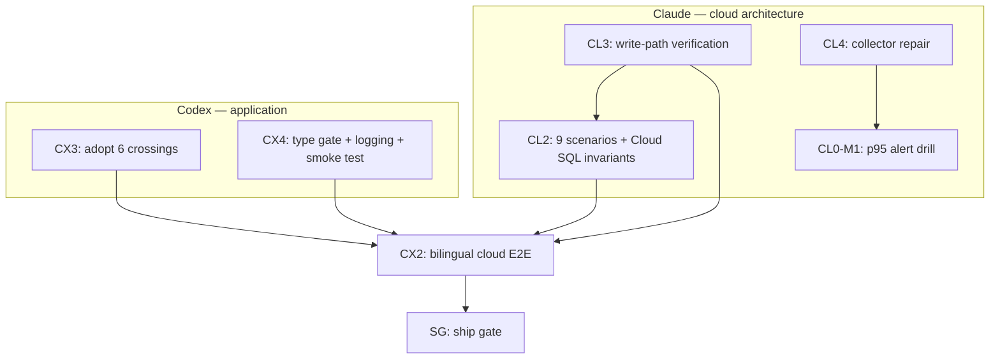
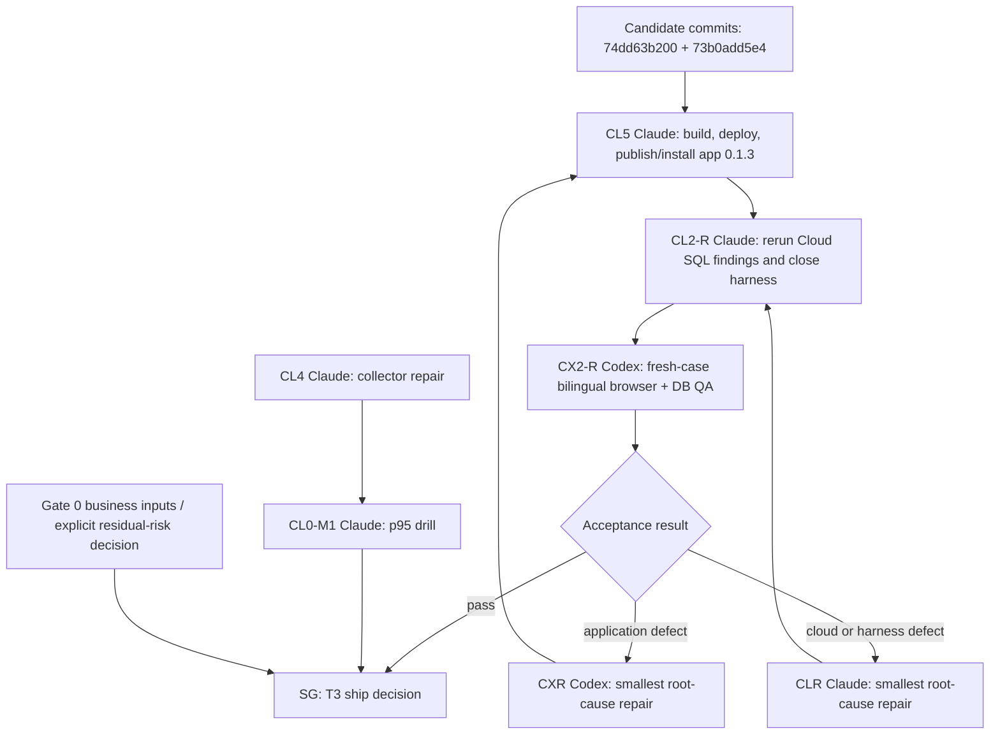
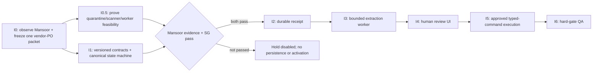

# Graph revision — parallel tracks to the 2026-08-19 demo

- Author: Claude Code (cloud architecture owner)
- Date: 2026-08-11
- Supersedes: nothing. This **adds** nodes to `2026-08-05 - Codex Claude Graph Engineering.md` and
  revises node states. Codex's original graph document is not rewritten.
- Demo: **2026-08-19** — 8 days from today.

## Why this revision exists

The original graph is a clean sequential chain: `CL2 + CL3 → CX2 → SG`. That serialisation is now
the schedule risk. Codex has **exactly one** node left (`CX2`) and it is blocked behind two Claude
nodes, so Codex is idle while I finish CL3. Meanwhile **eleven** Codex-owned items have accumulated
from the CL3 deploy campaign and are sitting in an evidence document rather than in the graph.

This revision opens two Codex tracks that are ready **now** and depend on nothing I am doing.

## Ownership, restated

| Domain | Owner |
|---|---|
| GCP infrastructure, Terraform, image build/deploy pipeline, monitoring, runbooks | **Claude Code** |
| Application source, contract, app manifest, Dockerfile, build tooling, tests | **Codex** |

I own cloud architecture end to end. Where I have already edited Codex-owned files, it was with
Shahil's explicit per-change approval, and every such change is listed below as **ADOPT** — Codex
reviews and takes ownership. **Do not re-implement an ADOPT item; it is already in the tree.**

## Ground truth as of 2026-08-11

Live environment: project `pashx-mab-pilot`, region `me-central1`, VM `pashx-mab-app`,
`https://34-18-165-1.nip.io`, Cloud SQL private-IP-only, gate open, ₹9,000 budget.

| Fact | State | Evidence |
|---|---|---|
| Infrastructure provisioned and applied | done | `terraform plan` → no changes |
| `/healthz` through public HTTPS + valid Let's Encrypt cert | **verified** | `HTTP 200 {"status":"ok"}` |
| Cloud SQL reachable, `core` schema initialised (71 tables) | **verified** | finding 25 |
| Workspace created and ACTIVE | **verified** | `160a3718-ce23-4150-9142-4e7ddd8b8850` |
| PashX app installed | **verified** | `058263f0-…@0.1.2`, 4 objects, 20 fields on `commercialDocument` |
| Command reaches Postgres, permissions clear | **verified** | operator role + `procurementIssue` |
| **Write path completes and stores correct values** | **NOT verified** | image `…1b17883cc` built, not yet deployed |
| `otel-collector` running | **NO — restart loop** | finding 26; blocks the p95 drill |
| Reconciliation twice / storage drill / p95 drill | not run | — |
| CL2 nine scenarios | written, **never executed** | — |

Nine images were built to get here. Six defects were pre-existing; three were mine. All are in
`docs/operations/pashx-mab-gcp/CL0-provisioning-evidence.md`, findings 17–34.

## Revised node states

| Node | Owner | Old state | New state |
|---|---|---|---|
| CL3 | Claude | ready | **active** — write-path verification is the last step |
| CL2 | Claude | ready | **ready** — unblocked once CL3's image is deployed |
| CL0-M1 | Claude | review | **blocked by finding 26** — the collector must run before the drill |
| CX2 | Codex | blocked | **blocked** (unchanged) — genuinely needs CL2 + CL3 |
| **CX3** | Codex | — | **ready NOW** — adopt the six boundary crossings |
| **CX4** | Codex | — | **ready NOW** — restore the type gate and error diagnosability |
| CL4 | Claude | — | **ready NOW** — collector repair |

## Node CX3 — Codex: adopt the six boundary crossings (ready now)

Six Codex-owned files were changed by me with Shahil's explicit approval, to unblock the deploy.
Each is already in the tree and working. Codex must **review and own**, not rebuild.

| # | File | Change | Finding |
|---|---|---|---|
| 1 | `packages/twenty-docker/twenty/Dockerfile` | 5 edits adding `pashx-mab-contract` to the server workspace path | pre-session |
| 2 | `packages/pashx-mab-contract/package.json` | added `"require": "./dist/index.js"` to `exports["."]` | 22 |
| 3 | `packages/twenty-server/src/modules/pashx-mab/pashx-mab.module.ts` | added `TokenModule` **and** `WorkspaceCacheStorageModule` | 23, 24 |
| 4 | `packages/twenty-apps/pashx-mab/src/objects/commercial-document.object.ts` | option values → `VENDOR_PURCHASE_ORDER` / `DRAFT`; field `currency` → `currencyCode` | 27 |
| 5 | `packages/twenty-server/src/modules/pashx-mab/utils/pashx-manifest-value.util.ts` | **new file** — contract↔manifest value translation | 27 |
| 6 | `…/services/pashx-vendor-purchase-order-persistence.service.ts` | manifest mapping on write; `createdBy`/`updatedBy` actor | 27, 29, 33 |

Judgement calls Codex should explicitly accept or reject:

- **Mapping direction** (item 4/5/6). I mapped at the manifest boundary so the contract keeps
  `vendorPurchaseOrder` / `draft` / `currency`. The alternative — reshaping the contract to
  UPPER_CASE — was rejected as letting a storage-layer validator dictate domain vocabulary.
  **There is no reverse mapping**, because nothing currently reads those columns back into contract
  space. That assumption breaks the day a read path is added.
- **Actor provenance** (item 6). `source: FieldActorSource.API`, not `MANUAL`, because the command
  arrives through the REST endpoint rather than a UI edit.
- **App version** is now `0.1.2` (bumped twice to work around finding 34).

## Node CX4 — Codex: restore the type gate and error diagnosability (ready now)

**This is the highest-leverage node in the graph.** Two systemic gaps caused or hid most of the
nine-build campaign. Fixing them is worth more than any single feature before the demo.

**CX4-a — there is no type gate anywhere (finding 32).**
`packages/twenty-server/nest-cli.json` sets `"builder": "swc", "typeCheck": false`, so `nest build`
transpiles without checking types. `npx nx typecheck twenty-server` also fails, in its
prerequisites (`twenty-ui:build`, `twenty-emails:build` — `npx vite build` exits non-zero, finding
28). A wrong named import therefore compiles, pushes green, and fails only at runtime. Four
findings — 22, 23, 24, 33 — were type errors that nothing checked. Each cost ~20 minutes of
build-and-deploy to discover.
Asked: make `tsc --noEmit` pass for `twenty-server` and run it in CI.

**CX4-b — unexpected errors are undiagnosable (findings 31, 33).**
`PashxVendorPurchaseOrderController` logs `errorType=TypeError` and nothing else. Sanitising the
payload is correct; sanitising away the message and stack is not. Two deploy cycles were spent
guessing at a one-line import bug that a logged stack would have identified immediately.
Asked: log `error.message` and `error.stack` for unexpected errors, still excluding the request
payload. Keep `PashxMabException` output exactly as it is.

**CX4-c — a boot smoke test (findings 17, 21, 22, 23, 24).**
No test in the suite starts the Nest application, so the first execution of any wiring change is in
production. A test that boots the app against a throwaway database would have caught five findings
in one pass.

**CX4-d — upstream robustness, lower priority.**
`entrypoint.sh` gates `database:init:prod` on the existence of the `core` **schema** rather than its
**tables**, so one interrupted first boot skips initialisation permanently while `/healthz` still
returns 200 (finding 25 — I ran init by hand; the gate is unfixed). And `app:publish --private`
records `latestAvailableVersion` **before** storing the tarball, producing a registration that can
neither install nor be re-published (finding 34 — worked around by bumping the version).

## Node CL4 — Claude: collector repair (mine, ready now)

`otel-collector` is in a restart loop (finding 26). It is the ingestion path for the p95 rollback
detector, so CL0-M1 cannot be drilled while it is down. Undiagnosed — I have not looked at it yet
and will not estimate it until I have.

## The loop

Two independent tracks, one synchronisation point.

Protocol is unchanged from the original graph: re-read graph, shared context, and artifact index
before claiming; claim one ready node; edit only owned paths; append a handoff with evidence.

Two additions, both learned the hard way this week:

1. **Verify value imports against the built artifact, not the source barrel.**
   `node -e "console.log(typeof require('<pkg>').<name>)"`. With no type gate, a source-level grep
   proves nothing. I verified an import path by grepping *after* my own edit and matched my own
   line — circular verification, two wasted cycles.
2. **One Terraform working copy.** A stale Cloud Shell tarball silently reverted three merged
   fixes (finding 20). Consolidate, or diff before every apply.

## 8-day plan

| Day | Claude (cloud) | Codex (application) |
|---|---|---|
| 1 (11 Aug) | deploy `…1b17883cc`; **verify the stored row**; start CL4 | claim **CX3**: adopt the six crossings |
| 2 | CL2 — execute the 9 scenarios via IAP tunnel (IDR-0002) | **CX4-a** type gate — highest leverage |
| 3 | CL2 finish; reconciliation ×2; storage drill | CX4-b logging; CX4-c smoke test |
| 4 | CL4 + CL0-M1 p95 alert drill | CX4-c finish; CX4-d if time |
| 5 | rollback + backup/PITR drills (never rehearsed) | **CX2** begins — CL2/CL3 complete |
| 6 | CL3/CL2 evidence, artifact index, handoffs | CX2 bilingual E2E |
| 7 | freeze infrastructure; teardown rehearsal | CX2 finish; SG prep |
| 8 (19 Aug) | **demo** | **SG** ship decision |

Two days of slack are deliberately absent. If a defect of the class we hit nine times appears again
it will consume a day, so days 6–7 are the buffer.

## Demo-critical vs demo-optional

If the schedule slips, cut in this order.

**Must work for the demo:** app reachable over HTTPS; login; the vendor purchase order command
succeeding end to end and storing correct values; the four PashX objects visible.

**Should work:** bilingual E2E (CX2); reconciliation idempotency; the p95 alert.

**Can slip past the demo, stated plainly so it is a decision and not a surprise:** the p95 rollback
drill (needs CL4 first), backup/PITR and rollback rehearsals, teardown rehearsal, CX4-d.

## Open decisions for Shahil — none blocking, all recorded

1. **`IS_SIGN_UP_DISABLED=true`.** Signup is open on an internet-facing host; anyone who finds the
   URL can create a workspace. Recommend enabling it now that the pilot workspace exists.
2. **The tfvars gate footgun (finding 19).** `terraform.tfvars` carries
   `h0_controls_recorded = false` while the live gate is open, so an apply that omits the `-var`
   flags plans a destroy of the entire environment.
3. **Two Secret Manager drifts.** `pashx-mab-pilot-admin-password` and
   `pashx-mab-pilot-operator-password` were created with `gcloud`, not Terraform.
4. **Demo data.** The pilot database holds only test fixtures. If the demo needs realistic
   procurement data, that is a seeding task nobody owns yet.

## 2026-08-12 continuation graph — current source of truth

This section supersedes the 2026-08-11 state table and day plan above. It does not invalidate their
historical evidence.

### State correction

The original CL2 connectivity conflict is resolved. Cloud SQL remains private-IP-only. CL2 used an
SSH/IAP local forward through `pashx-mab-app` to a loopback-bound forwarder; no public database IP,
authorized network, or new ingress rule was added. Do not repeat the connectivity investigation or
temporarily expose Cloud SQL.

Measured state now:

| Node | State | Evidence / remaining work |
|---|---|---|
| CL2 | review, 67/69 | Real Cloud SQL suite executed. Wrapped-number conflict and missing-token status were the only findings. |
| CL3 | complete | HTTPS health, app install, write, replay, numbering, reconciliation, and storage evidence exist. |
| CX3 | complete | Six deploy boundary crossings adopted. |
| CX4 | complete | Server type gate, diagnostics, boot smoke, recovery gates, and app-dev runtime passed CI. |
| CX5-1 | implementation complete | Wrapped `name` conflict now maps to `409 PASHX_NUMBER_CONFLICT`; read timeout maps to retryable 503. Cloud recheck pending. |
| CX2-R | **complete — passed** | PashX `0.1.11` on host digest `fbe0ae9e5917…` returned bounded success `MAB-VPO-2026-0004`. Cloud SQL proves case version 1 and exactly one document, receipt, and audit event; counter `vendorPurchaseOrder/2026=4`. |
| CL4 / CL0-M1 | ready / blocked by CL4 | Collector repair and the p95 alert drill remain cloud-owned parallel work. |
| SG | **complete — SHIP internal pilot** | CX2-R, CL0-M1, Gate 0 technical 9/9, and Shahil business sign-off complete. Real-data/general-production promotion remains outside this scoped decision. |

### Next executable graph

Only create `CXR` or `CLR` after evidence identifies the failing boundary. A failed QA observation is
not itself authorization for both agents to edit the same path.

### CL5 + CL2-R — Claude task, ready now

Inputs: branch `codex/pashx-pilot-cx3-cx4`, commits through `73b0add5e4`; application `0.1.3`.

1. Pause scheduled shutdown for the bounded build/test window.
2. Build an immutable production image from the candidate commit and record tag plus digest.
3. Deploy without changing the private Cloud SQL boundary or reopening IDR-0002.
4. Publish and install PashX MAB app `0.1.3`; prove the installed version from metadata.
5. Rerun CL2 scenario 8 and require `409 PASHX_NUMBER_CONFLICT` with no partial writes.
6. Align the missing-token assertion with Twenty's established fail-closed guard contract (`403`),
   already proven by CX4, unless new evidence shows the application is bypassing authentication.
7. Run all 69 CL2 assertions and require 69/69. Do not hide a product failure by weakening an
   invariant; only the already-adjudicated 401/403 semantic expectation may change.
8. Record image, installed app version, exact commands, database counts, and teardown. Restore the
   test environment file and stop the CL2 tunnel/forwarders after evidence is captured.

Acceptance: immutable digest deployed; app `0.1.3` installed; CL2 69/69; wrapped conflict is typed;
no partial writes; pilot database untouched by destructive tests; temporary CL2 resources removed.

### CX2-R — Codex task, complete 2026-08-14

Use a new disposable Procurement Case and exactly one initial submission.

1. Verify English success from launcher through typed command result.
2. Verify Arabic document direction, translated PashX copy, focus order, keyboard operation, and
   required 44 px targets.
3. Exercise required-supplier validation, active cancel, 30-second timeout/error boundary, and one
   unchanged idempotent retry without creating a second business document.
4. Verify through read-only database evidence: exactly one document, one receipt, one audit event,
   one number allocation, and one case-version increment for the successful command.
5. Publish a pass/fail matrix. For each failure, identify the boundary before opening a repair node.

Acceptance: no indefinite `Creating...`; success or bounded actionable error; bilingual/RTL and
accessibility gates pass; browser result agrees with database state; no hidden retry or duplicate.

Final result: passed on a fresh disposable case. The shared renderer dispatch repair, sandbox-safe
UUID generation, and missing Admin capability assignment were deployed before the successful run.
The successful case has exactly one document, one command receipt, one audit event, one case-version
increment, and one allocated number. Detailed evidence is in
`docs/execution/evidence/CX2-submission-resilience.md`. Claude may now resume CL0-M1 Phases B–E
using the recorded real Vendor PO traffic.

### Repair loop and stop conditions

- Codex owns application/contract/UI/Docker/build-tool repairs. Claude owns GCP, deployment,
  monitoring, runbooks, and the CL2 harness.
- The observing agent publishes reproduction, correlation/time window, expected versus actual, and
  evidence. The owning agent repairs the smallest root cause and adds a focused regression test.
- Every repair invalidates only the evidence that crosses the changed boundary. Rerun the focused
  regression, then the downstream node; do not rerun unrelated passed work.
- Stop and ask Shahil before schema migration, public database exposure, destructive pilot-data
  action, ownership-boundary change, or scope expansion into Autopilot.
- Operations Inbox may advance before SG only through I0 (Mansoor observation and frozen packet),
  I0.5 (infrastructure feasibility), and I1 (versioned contracts, canonical state machine, and
  compatibility tests) on an isolated branch/worktree with the feature disabled. I2-I6 remain
  blocked until both Mansoor's evidence confirms intake/rekeying is the bottleneck and SG passes,
  unless Shahil explicitly accepts the named residual risk.

### Reduced parallel Inbox graph (approved 2026-08-13)

Codex owns the I1 shared contract and application-facing tests. Claude owns CL5/CL2-R and may
challenge the Inbox plan, but Claude findings do not change an approved boundary without an explicit
recorded decision. Both agents must exchange evidence through this graph/design artifact rather than
editing the same module concurrently.

### 2026-08-13 CX2-R escalation after app 0.1.4

`pashx-mab` `0.1.4` was built, published, and installed on `pashx-pilot`. Browser QA proved the
compiled timeout race was loaded, yet the first submission remained pending beyond 40 seconds.
Cancel still provided operator recovery. This falsifies the assumption that an app-local rejecting
timer can settle while the host-fetch bridge is awaiting the REST request.

Read-only Cloud SQL and log diagnosis found no document, receipt, audit event, number allocation,
case-version increment, or Nest controller execution. Codex implemented the shared host-boundary
deadline and app `0.1.5` timeout translation with a focused passing regression. Next executable task:
build and deploy an immutable host image containing the renderer change, publish/install private app
`0.1.5`, and then rerun CX2-R once on a new disposable case. Do not retry against the current host.
