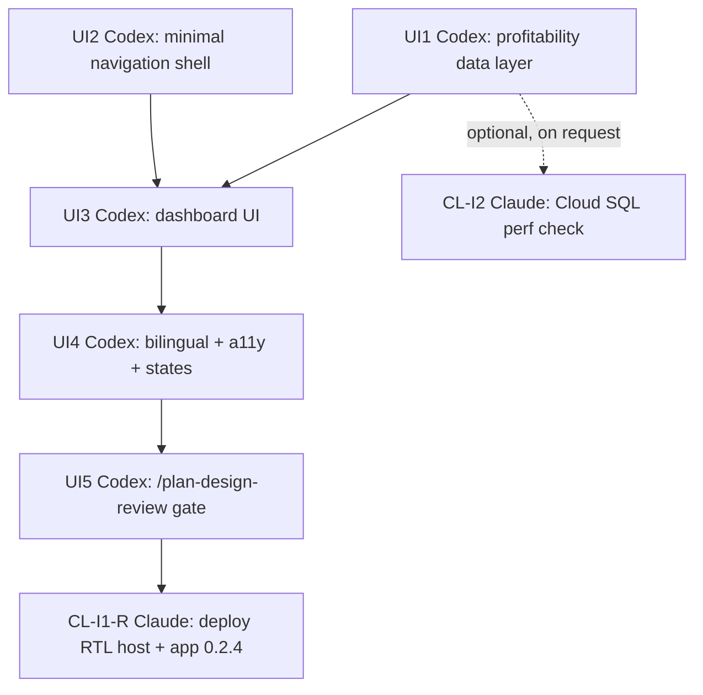

# Post-SG interface graph — navigation shell + profitability dashboard

- Author: Claude Code, on Shahil's instruction ("tell codex lead dashboard build" /
  "create a plan and graph... for the dashboard build")
- Date: 2026-08-14
- Supersedes: nothing. This is a new graph for a new phase, opened after `SG` shipped
  (`docs/execution/evidence/SG-ship-decision.md`). It does not reopen or restate the T3 Vendor PO
  graph in `2026-08-05 - Codex Claude Graph Engineering.md` or its `2026-08-11`/`2026-08-12`
  revisions — those are complete and closed.
- Model: dependency-driven graph engineering, the same model this project has used since
  2026-08-05 (`2026-08-05 - Codex Claude Engineering Loop.md` records that the older
  loop-based model was superseded by this one; there is no separate "loop" to stand up).

## Scope — read this before claiming a node

Shahil's authorization for this phase is specific: **"navigation shell + read-only operational
profitability dashboard, backed by real finalized records."** That is narrower than the full
Command centre vision recorded in `Pashx - MAB Procurement Pilot Design.md` and `DESIGN.md`.

**In scope:**
- Enough navigation to reach the dashboard (Twenty's native navigation drawer, PxD labels/mark,
  per `DESIGN.md`'s navigation mapping) — not the full Work/Records/Control Command centre.
- The Operational profitability dashboard itself, read-only, per decision **15A** in the design
  doc: revenue from finalized customer invoices, direct cost from finalized vendor documents plus
  approved recorded direct expenses, gross profit/margin using the frozen rounding/zero-revenue
  rules, grouping and drill-through by case/customer/project/owner/period, always showing as-of
  time, filters, and inclusion rules.
- Bilingual (English/Arabic, RTL), accessibility, and interaction-state coverage (loading/empty/
  error/partial) for exactly this dashboard and nav.
- The `/plan-design-review` visual-acceptance gate before calling this done, per the existing
  structure-only approval on `profitability-dashboard-20260805/finalized.html`.

**Explicitly out of scope for this graph — each needs its own separate authorization:**
- The full Command centre (three-signal work queue, Getting-started checklist, Deals Kanban).
- Staged import correction ledger, OCR review workspace.
- ZATCA compliance tracking and bilingual document generate/preview/issue flow.
- The AI insight feed (16A) — even though it's explanation-only and cannot mutate records, it is
  materially more scope than a deterministic read-only dashboard and was not named in Shahil's
  authorization.
- Anything from the Autopilot/Operations Inbox expansion — already recorded elsewhere as blocked
  behind `I0` (Mansoor's observation) and explicitly not enlarged by this work.

If a node below turns out to need one of these, stop and ask Shahil rather than absorbing it
quietly — this is the same discipline the T3 graph held throughout CL5/CX2-R.

## 2026-08-14 correction — read before continuing (Codex)

Shahil reviewed mockups shared today and flagged two things directly:

1. **Scope hold, reaffirmed.** The mockups included a full Command centre (Quotations, Approvals
   with decision checks, full PO workflow, Vendors, Documents, Compliance), the AI insights panel
   on the dashboard (16A), and screens resembling Email Marketing/Blog/SEO/Outreach/LinkedIn and
   OCR/Autopilot/ERP-sync tooling. None of that is authorized for this phase — see "Explicitly out
   of scope" above. This phase is **nav shell + read-only profitability dashboard only**, including
   dropping the AI insights panel from UI3 for now. If any of that work already exists, it's fine to
   keep it uncommitted/behind a flag for later, but it should not ship in this graph's deliverable.
2. **Branding correction.** The app name and logo/wordmark is **PxD** — not "PashX" or "PashxD" as
   shown in the mockups. This is UI-facing branding only (nav mark, wordmark, labels): it does not
   rename internal package/service identifiers (`pashx-mab`, `PashxCapabilityService`, the
   `packages/twenty-apps/pashx-mab` path, etc.) — those stay as-is unless Shahil separately
   authorizes a full rename. `DESIGN.md`'s prose ("PashX MAB Design System", "PashX" throughout)
   needs the same correction; its `--px-*` CSS token prefix already matches PxD and does not need
   to change.

## Ownership, unchanged from every prior graph in this project

| Domain | Owner |
|---|---|
| Application source, PashX UI, data/aggregation queries, contract, bilingual/accessibility QA | **Codex** |
| GCP infrastructure, image build/deploy pipeline, Cloud SQL performance verification if needed | **Claude Code** |

Claude has no assigned build node in this graph — Codex leads. Claude's nodes exist to support
deployment once Codex's work is ready, per the coordination pattern below.

## Nodes

| Node | Owner | Depends on | Deliverable |
|---|---|---|---|
| **UI1** | **Codex — complete 2026-08-14** | none | Profitability data layer: bounded typed reads plus deterministic aggregation implementing 15A's revenue/cost/margin rules. Currency totals remain separate, arithmetic uses safe integer micros and BigInt, every excluded record is counted, and the dashboard receives drill-through contributions and case/customer/project/owner/period breakdowns. Shahil approved the metadata extension and frozen rules; evidence is recorded in `docs/execution/evidence/UI1-profitability-data-contract-gap.md`. |
| **UI2** | **Codex — complete 2026-08-14** | none | Minimal navigation shell: native Twenty navigation drawer, PxD labels/mark/active-accent, RTL order, enough routing to reach the dashboard. Not the full Command centre. Official app build passes; runtime deployment remains CL-I1. |
| **UI3** | **Codex — complete in source 2026-08-14** | UI1 + UI2 | Native Twenty Evidence Ledger dashboard shipped in app source `0.2.0`: real current/prior UI1 reads, seven filters, separate currencies, ruled KPI ledger, shared-scale trend plus exact table, deterministic margin bridge, ranked cases, complete exclusion coverage, and record drill-through. No AI insight feed. Evidence: `docs/execution/evidence/UI3-evidence-ledger-dashboard.md`. |
| **UI4** | **Codex — complete in source 2026-08-14** | UI3 | App `0.2.1`: complete English/Arabic copy and native manifest translations, reactive host locale, true RTL with canonical-value isolation, keyboard/focus/44px target foundations, light/dark WCAG contrast, chart table equivalent, and localized loading/empty/error/partial states. Evidence: `docs/execution/evidence/UI4-bilingual-accessibility-acceptance.md`. |
| **UI5** | **Codex — runtime active; only manual device checks remain 2026-08-20** | UI4 | Live `0.2.5` passes identity, navigation, English/Arabic LTR/RTL, typography, light/dark empty state, accessibility-tree structure, 44px targets, responsive no-overflow checks, and approved disposable success/partial/error acceptance. The run found and fixed the `0.2.4` invalid-date host crash; all five uniquely tagged fixtures were deleted and zero remain. Only manual native Tab/VoiceOver/exact-200%-zoom observation remains. Evidence: `docs/execution/evidence/UI5-design-acceptance.md`. |
| **CL-I1** | **Claude — complete 2026-08-20** | UI5 interim request | Live host digest `sha256:57f0f9b9…`, app `0.2.3` installed cleanly, `/healthz` 200, PxD browser/PWA assets live. |
| **CL-I1-R** | **Claude — complete 2026-08-20** | UI5 runtime repair | Immutable host digest `sha256:c48dd052…` deployed; app `0.2.4` published/installed cleanly; `/healthz` 200 and `core.application` verified. Codex's live-shell retest confirms `lang="ar"`, `dir="rtl"`, computed RTL, Arabic font selection, and no mobile overflow. |
| **CL-I2** | Claude | UI1, only if requested | Cloud SQL query-performance spot check for the profitability aggregation against real pilot data volume. Likely unnecessary given current pilot data size; available on request, not pre-emptively scheduled. |

## Coordination — same protocol as every graph before this one

1. Re-read this graph and the shared ledger (`Pashx - MAB Agent Shared Context.md`) immediately
   before claiming a node — do not rely on chat memory.
2. Claim by changing only your node's row here (or a mirrored row in the ledger) and appending a
   handoff entry using the ledger's existing handoff template.
3. Edit only your owned paths. UI1–UI5 are Codex's; CL-I1/CL-I2 are Claude's.
4. Claude's CL-I1 is genuinely blocked until Codex signals a ready state — there is nothing to
   build or deploy before then. No standing wakeup or poll is scheduled; Claude picks this up
   when the ledger shows UI5 (or an earlier interim-deploy request) complete.
5. Stop and ask Shahil before absorbing any of the explicitly-out-of-scope items above, before
   any schema/migration change, or before anything that would touch real (non-disposable) MAB
   data — same stop conditions as the T3 graph.

## Status

UI1 and UI2 are complete in source. UI1's aggregation suite passes 5/5 with 100% statement,
branch, function, and line coverage; the contract suite passes 9/9 at 100%; both package linters
and the official app build pass. Shahil approved the fresh Evidence Ledger direction on 2026-08-14,
UI3 is complete in source and UI4 supersedes its application build as app `0.2.1`. All 14 app tests
pass; UI1 remains at 100% coverage; the UI3 model remains above its enforced 90/80/90 thresholds;
all five UI4 bilingual/accessibility/contrast suites pass; the generated manifest contains all 16
Arabic messages; lint, contract build, official app build/typecheck, and `git diff --check` pass.
UI5's seven-pass source-plan review is complete at 10/10 and all six accepted repairs plus the PxD
host/application rebrand pass as app `0.2.3`: 17/17 app tests, 8/8 UI5 source suites, both coverage gates, contract tests, lint, contract
build, official Twenty build/typecheck, and whitespace validation. The dashboard checksum is
`ef05cbfff82e9512650c17873adf6aeb59cfa6fc8ae3a26844ff0b9ba2ff417b`; the manifest includes all
16 Arabic messages and ten logo/cover/font/license/provenance assets, with manifest SHA-256
`59c144422ba5ced2a912443cc536089cc34d311ffc1e4a2613a79a267016626f`. Billing and infrastructure are restored;
CL-I1 deployed the PxD host and app `0.2.3`; UI5 runtime acceptance found that the front-component
renderer stripped `dir`/`lang`, leaving Arabic computed LTR. CL-I1-R then deployed host digest
`sha256:c48dd052…` and app `0.2.4`; `/healthz`, installed-version evidence, English LTR, Arabic
`lang="ar"`/`dir="rtl"`, computed RTL, Arabic typography, accessibility-tree structure, mobile
touch targets, and no-overflow checks now pass. Manifest SHA-256 is
`ce42cb30072fb0d497429a4c5c14f115c9f2b57cb8a9e31f5f5572aaaca919e4`. Shahil then approved a
uniquely tagged disposable fixture. Success and partial totals rendered correctly, but the native
invalid-date exercise found an uncaught `RangeError` in user-controlled date formatting. App
`0.2.5` repairs that path, passes 18/18 app tests and the official build, is installed and verified
in `core.application`, and now keeps the last successful evidence plus a named validation alert.
All five fixture records were deleted by captured ID and a public-API query confirms zero remain.
UI5 stays open only for manual native Tab/VoiceOver/exact-200%-zoom observation.

## GSTACK REVIEW REPORT

| Review | Trigger | Why | Runs | Status | Findings |
|--------|---------|-----|------|--------|----------|
| CEO Review | `/plan-ceo-review` | Scope & strategy | 0 | — | Post-SG scope was already approved and frozen outside this review. |
| Codex Review | `/codex review` | Independent 2nd opinion | 0 | — | Not run. |
| Eng Review | `/plan-eng-review` | Architecture & tests (required) | 0 | REQUIRED | No fresh logged engineering review for the UI5 repair candidate. |
| Design Review | `/plan-design-review` | UI/UX gaps | 1 | CLEAR | Score 8/10 → 10/10; 6 decisions accepted; 7 build/acceptance tasks; 0 unresolved. |
| DX Review | `/plan-devex-review` | Developer experience gaps | 0 | — | Not applicable to this interface gate. |

**VERDICT:** DESIGN CLEARED — implement UI5 repairs and runtime matrix; eng review required before shipping the repaired candidate.

NO UNRESOLVED DECISIONS
