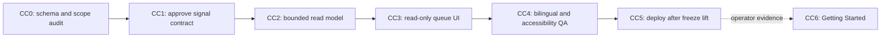

# Command Centre graph — deterministic three-signal queue

- Author: Codex
- Date: 2026-08-21
- Status: **CC3/CC4 corrected in source; CC5 awaits immutable publish and live visual acceptance**
- Product authority: Shahil's 2026-08-21 instruction to proceed after selecting the Command Centre
  as the next phase.
- Execution model: dependency-driven graph engineering.

## Outcome

Build a bilingual, accessible PxD Command Centre whose first viewport answers three questions with
authoritative pilot data:

1. What requires the signed-in user's action?
2. What is blocked by missing or invalid data?
3. What has a compliance exception?

The first release is a read-only queue with evidence links. It does not introduce optimistic
workflow transitions, a general approval engine, OCR, Autopilot, AI narration, or Deals Kanban.

## Freeze boundary

The client-demo environment remains pinned to app `0.2.5` and host digest
`sha256:c48dd052dcf79ca6fa18cee90d47d66b10a16ab813688106650ee06b1e66156d`.
Planning, contract review, and source-only work may proceed. No publish, install, host deployment,
Terraform apply, migration, or live data mutation occurs until Shahil explicitly lifts the freeze.

## Contract finding

The existing `procurementCase` metadata stores `name`, `aggregateVersion`, `customerRecordId`,
`projectName`, and `ownerRecordId`. The approved design also expects authoritative stage, next
action, deadline/age, blocker, business health, and compliance health. Those values do not exist as
case fields today. Inferring them loosely in the browser would turn presentation guesses into
workflow truth.

CC1 therefore freezes the smallest server-owned contract before UI implementation. Proposed rules
and explicit gaps are in `docs/execution/evidence/CC1-command-centre-signal-contract.md`.

## Scope

### In scope for CC1–CC5

- bounded, read-only, workspace-scoped queue query;
- deterministic classification into action, blocked-data, and compliance-exception signals;
- evidence reason codes and direct links to authoritative Twenty records;
- role-aware filtering using existing workspace identity and capabilities;
- English/Arabic, semantic RTL, keyboard, VoiceOver, 44px targets, and 200% zoom;
- loading, empty, error, partial, and success states;
- native Twenty page layout and navigation entry branded PxD;
- source tests and a deployment handoff after the demo freeze is lifted.

### Explicitly deferred

- Getting Started checklist (CC6, after queue adoption);
- Deals Kanban and stage transitions (separate graph);
- command actions inside queue cards;
- OCR review, ZATCA submission operations, import correction ledger;
- Operations Inbox/Autopilot and AI-generated recommendations;
- new approval workflows or accounting behavior.

## Nodes

| Node | Owner | Depends on | Deliverable | State |
|---|---|---|---|---|
| **CC0** | Codex | none | Reconcile approved design, current metadata, and frozen demo boundary. | **complete 2026-08-21** |
| **CC1** | Codex + Shahil approval | CC0 | Freeze signal vocabulary, precedence, reason codes, timestamps, and minimal metadata extension. No migration before approval. | **approved 2026-08-21** |
| **CC2** | Codex | CC1 | Typed bounded read model and deterministic classifier; workspace/role scoping; unit and contract tests. | **complete in source 2026-08-21** |
| **CC3** | Codex | CC2 | Native Twenty read-only Command Centre page and navigation entry; evidence drill-through. | **corrected in source 2026-08-21; live parity pending** |
| **CC4** | Codex | CC3 | English/Arabic, RTL, accessibility, responsive behavior, and complete runtime-state tests. | **source tests complete 2026-08-21; physical/live checks pending** |
| **CC5** | Codex + Claude | CC4 + freeze lifted | Source acceptance, immutable publish/install, live smoke test, rollback and evidence. | **not accepted; app 0.2.6 remains available for diagnosis** |
| **CC6** | future graph | CC5 + operator feedback | Role-aware deterministic Getting Started checklist. | deferred |

## Stop conditions

Stop for Shahil before:

- adding or changing metadata fields or select options;
- defining a financial/workflow state that is not already authoritative;
- enabling queue-card mutations or stage changes;
- deploying while the demo freeze remains active;
- touching non-demo live records.

## Next ready decision

CC5 is ready for Claude's immutable app-only publish/install handoff. Codex replaced the stacked
signal-card presentation with a single ruled priority ledger, retained the three-signal summary as
one band, and added a bounded-read context panel using only CC2 counts. The implementation matches
the approved PxD operational language without inventing unsupported workflows, fake counts, or
mutations. After publish, Codex must compare the live desktop/200%-zoom/RTL views against the 8
August references and repeat keyboard/VoiceOver acceptance before CC5 can close.
