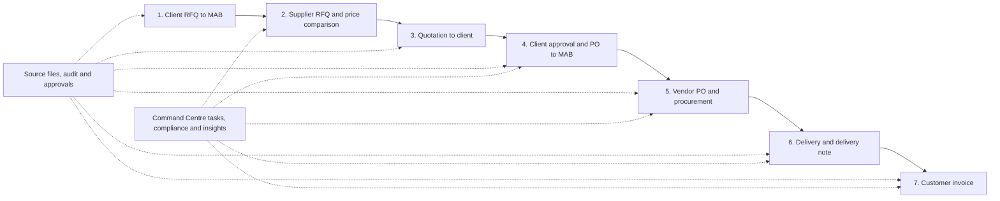

# MAB operating workflow graph — PxD end-to-end contract

- Date: 2026-08-24
- Source: Shahil-supplied `MAB – Operating Process Workflow`
- Status: **WF1 complete in source; WF2 ready**

## Required operating path

## Streamlining requirements

- One Procurement Case carries the full chain without duplicate records or manual re-keying.
- Every document has an explicit business role, counterparty, reference, date, amount when
  applicable, lifecycle state, source file, and predecessor/successor relation.
- Supplier comparison is deterministic and evidence-linked; price, delivery, quality, and terms are
  visible before the human decision.
- Client and internal approvals are human-only, permission-checked, idempotent, audited, and use
  optimistic concurrency.
- Delivery supports partial/full status, due date, receipt/evidence, and delivery-note linkage.
- Invoice eligibility derives from approved/delivered evidence; agents may recommend but may not
  finalize financial documents or change compliance state.
- Command Centre surfaces new RFQs, approvals, overdue procurement/delivery, invoice readiness,
  missing evidence, compliance exceptions, and next tasks with native drill-through.
- English/Arabic, RTL, keyboard, screen-reader and 200% zoom acceptance apply throughout.

## Delivery nodes

| Node | Owner | Deliverable | State |
|---|---|---|---|
| **WF0** | Shahil + Codex | Accept the seven-stage workflow as product truth. | **complete 2026-08-24** |
| **WF1** | Codex | Typed document/transition contract for RFQ, supplier RFQ, quotation, client PO, vendor PO, delivery note and invoice. | **complete 2026-08-24 — source only** |
| **WF2** | Codex (executed via DeepSeek harness) | Idempotent commands, human approval, audit and transition tests. | **complete in source 2026-08-24 — 14/14 integration suites, 109/109 assertions** |
| **WF3** | Codex (executed via DeepSeek harness) | Native case timeline, price comparison, delivery and invoice-readiness UI matching the approved mockups. | **complete in source 2026-08-25 — native case timeline, price comparison, delivery and invoice-readiness UI; app suite 69/69; evidence docs/execution/evidence/WF3-case-workflow-ui.md** |
| **WF4** | Claude | Publish/install and live data/permission/rollback QA. | **complete per Claude 2026-08-25 — app 0.2.11 published/installed; live /healthz rechecked 200 by DeepSeek; Claude's detailed evidence commit (shasum/digest/rollback) expected** |
| **WF5** | Codex + Claude | End-to-end bilingual acceptance using one disposable case plus verified MAB evidence. | **ready — Codex side may begin source prep; Claude leads live acceptance** |

## WF4 handoff to Claude (assigned 2026-08-24)

Claude owns publish/install and live QA only; DeepSeek delivers WF2+WF3 source and signals WF3
ready before WF4 begins. WF4 must not begin merely because source tests pass.

**What WF4 will publish (app version after 0.2.10, exact bump at publish time):**

- WF1 metadata: nine workflow document roles (`customerRfq`, `supplierRfq`, `vendorQuote`,
  `customerQuote`, `customerPurchaseOrder`, `vendorPurchaseOrder`, `deliveryNote`, `vendorInvoice`,
  `customerInvoice`) and the frozen transition contract — currently source-only.
- WF2 metadata: new `procurementCase` fields `deliveryStatus` (`NOT_STARTED`/`PARTIAL`/`FULL`) and
  `deliveryDueAt`; install applies this workspace metadata migration.
- WF2 REST command endpoints (all capability-gated, fail closed without a PashX role):
  - `POST /rest/pashx-mab/procurement-cases/:id/transitions` — `caseEdit`
  - `POST /rest/pashx-mab/commercial-documents/:id/finalize` and `/cancel` — `documentEdit`
  - `POST /rest/pashx-mab/procurement-cases/:id/delivery` — `deliveryRecord`
  - The WF2 integration suites (11–14) remain the pre-deploy verification; no live command writes.

**Live QA expectations (mirror DS5 conventions):**

- Publish/install the new app version under the unchanged application identity; record manifest
  shasum, host digest, `/healthz`, and keep `0.2.10` as the rollback target.
- Verify the four new endpoints fail closed for viewer/evidence-agent principals and do not mutate
  live data; any disposable fixtures must be deleted by captured ID and verified absent.
- Do not send/delete email, finalize financial documents, approve/reject on behalf of a human, or
  change compliance state. Live data/permission findings are Claude's repair; source regressions
  return to DeepSeek with evidence.

OCR and synchronized email intake remain separate gated inputs. They may create review drafts only;
they cannot approve, send/delete email, finalize documents, or change compliance state.
