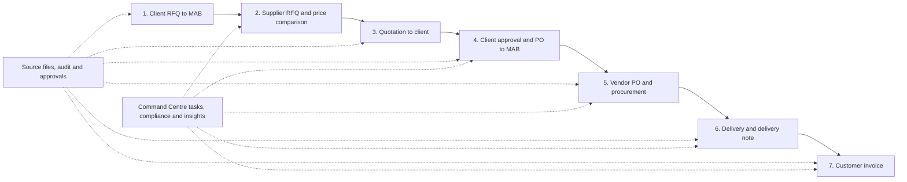

# MAB operating workflow graph — PxD end-to-end contract

- Date: 2026-08-24
- Source: Shahil-supplied `MAB – Operating Process Workflow`
- Status: **WF1 complete in source; WF2 ready**

## Required operating path

## Streamlining requirements

- One Procurement Case carries the full chain without duplicate records or manual re-keying.
- Every document has an explicit business role, counterparty, reference, date, amount when
  applicable, lifecycle state, source file, and predecessor/successor relation.
- Supplier comparison is deterministic and evidence-linked; price, delivery, quality, and terms are
  visible before the human decision.
- Client and internal approvals are human-only, permission-checked, idempotent, audited, and use
  optimistic concurrency.
- Delivery supports partial/full status, due date, receipt/evidence, and delivery-note linkage.
- Invoice eligibility derives from approved/delivered evidence; agents may recommend but may not
  finalize financial documents or change compliance state.
- Command Centre surfaces new RFQs, approvals, overdue procurement/delivery, invoice readiness,
  missing evidence, compliance exceptions, and next tasks with native drill-through.
- English/Arabic, RTL, keyboard, screen-reader and 200% zoom acceptance apply throughout.

## Delivery nodes

| Node | Owner | Deliverable | State |
|---|---|---|---|
| **WF0** | Shahil + Codex | Accept the seven-stage workflow as product truth. | **complete 2026-08-24** |
| **WF1** | Codex | Typed document/transition contract for RFQ, supplier RFQ, quotation, client PO, vendor PO, delivery note and invoice. | **complete 2026-08-24 — source only** |
| **WF2** | Codex | Idempotent commands, human approval, audit and transition tests. | **ready** |
| **WF3** | Codex | Native case timeline, price comparison, delivery and invoice-readiness UI matching the approved mockups. | blocked on WF2 |
| **WF4** | Claude | Publish/install and live data/permission/rollback QA. | blocked on WF3 |
| **WF5** | Codex + Claude | End-to-end bilingual acceptance using one disposable case plus verified MAB evidence. | blocked on WF4 |

OCR and synchronized email intake remain separate gated inputs. They may create review drafts only;
they cannot approve, send/delete email, finalize documents, or change compliance state.
