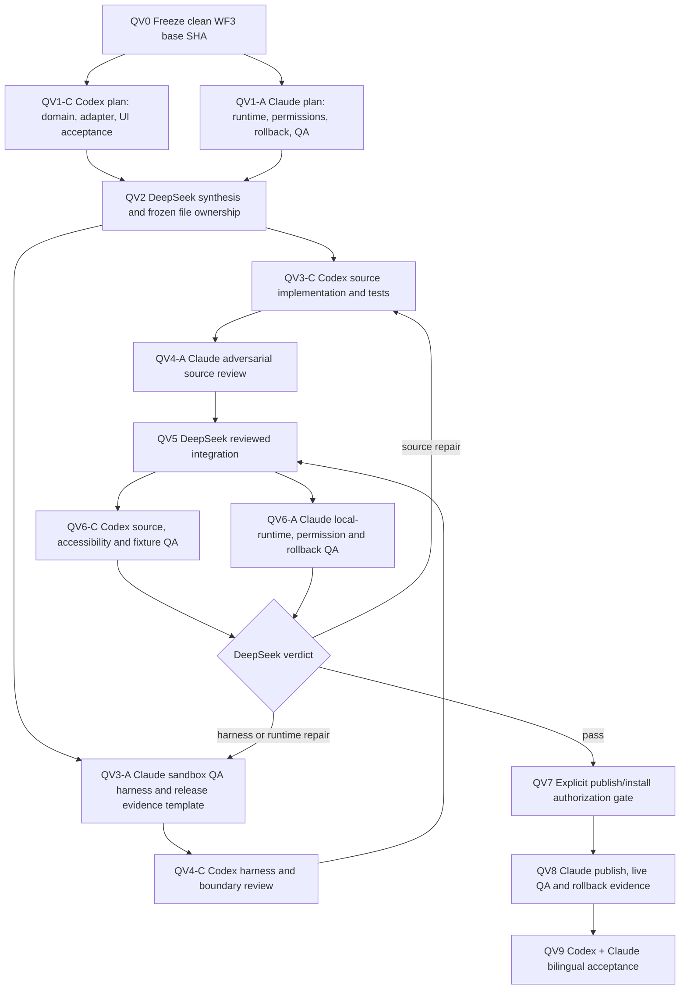

# Quotation and vendor comparison — parallel DeepSeek harness graph

- Date: 2026-08-25
- Coordinator: DeepSeek harness
- Source owner: Codex
- Runtime, release and adversarial-QA owner: Claude Code
- Product authority: Shahil
- Status: **approved to plan; code lanes blocked until WF3 has a clean, recorded base commit**
- Scope: the next native PxD page after the operating-workflow case page

## Product decision

Build **Quotation & Vendor Comparison** before a standalone Vendor directory. This page advances the
MAB operating workflow from supplier RFQ through vendor comparison and quotation to the client. It
may drill through to existing vendor records, but vendor CRUD is not part of this node.

The page must help a human operator answer four questions without re-keying data:

1. Which suppliers were invited and which replied?
2. How do price, delivery, commercial terms and evidence compare?
3. What is the deterministic recommendation, and what evidence or compliance issue limits it?
4. Is the customer quotation ready for a human to review and issue?

No agent may select a supplier, approve a quotation, finalize a financial document, change
compliance state, send/delete email or mutate the live pilot from this source-development loop.

## Target page contract

The native Twenty page must include:

- a case header with client RFQ, due date, stage and evidence completeness;
- summary signals for suppliers invited, responses received, response deadline and price variance;
- a comparison table with supplier, CR/VAT identity, quoted total and currency, lead time, payment
  terms, validity, status and source-evidence link;
- deterministic scoring with the formula visible. Incomplete, conflicting or incomparable inputs
  must produce **No recommendation**, never a fabricated ranking;
- a customer-quotation summary linked to the selected source quotations, while preserving the
  human-only selection and approval gates;
- next task, approval and compliance signals with native drill-through;
- loading, empty, partial-evidence, conflict, error and no-permission states;
- English/Arabic copy, correct RTL layout, keyboard operation, screen-reader semantics, 44px touch
  targets and usable native 200% zoom;
- only verified MI5/WF evidence or explicitly inventoried sanitized fixtures. No accepted pilot
  evidence may be rewritten or mixed with disposable QA records.

## Architecture boundary

- Use the accepted WF1 document roles and WF2 transactional commands. Do not invent a parallel
  quotation state machine.
- Read through one case-scoped adapter so the UI cannot join unrelated workspace records.
- Amounts, currencies and units remain typed; missing conversion rules must be shown as
  incomparable rather than silently converted.
- Ranking is a pure, testable function over frozen inputs. AI may explain evidence-linked results
  but may not produce or override the ranking.
- The page is app-level unless a missing server capability is proven by a failing contract test.
- No publish/install/deploy, infrastructure change, mailbox access, OCR enablement or live-data
  mutation occurs before the explicit release gate.

## Sandbox and branch protocol

The current primary worktree contains concurrent WF2/WF3 and metadata-import changes. It is not a
safe base for parallel writing.

1. DeepSeek waits for WF3 to be committed and recorded in the shared ledger, then records
   `BASE_SHA=<40-character commit>` and verifies `git show "$BASE_SHA"` succeeds.
2. DeepSeek creates isolated sibling worktrees from exactly `BASE_SHA`:

   | Lane | Suggested branch | Suggested worktree | Write authority |
   |---|---|---|---|
   | Integration | `deepseek/qv-integration` | `../twenty-qv-integration` | DeepSeek applies reviewed commits only |
   | Codex source | `deepseek/qv-codex` | `../twenty-qv-codex` | App, contract and source tests only |
   | Claude harness | `deepseek/qv-claude` | `../twenty-qv-claude` | QA harness, release checklist and evidence only |

3. Each worktree gets its own dependency/cache and `.env` boundary. Secrets, pilot credentials,
   `.env.test`, database dumps and browser profiles must not be copied between lanes.
4. Agents never edit another lane and never commit unrelated dirty files. Handoffs use commit SHAs,
   patches and evidence documents, not a shared writable checkout.
5. The integration lane may cherry-pick only commits that passed the reciprocal review gate.
6. Local containers must use lane-specific project names and ports. They may use sanitized fixtures
   only and must be stopped after QA.

If WF3 cannot be represented by a clean commit, code lanes remain blocked. Plan agents may continue
read-only, but DeepSeek must not copy the dirty primary worktree into a sandbox and call it isolated.

## Parallel graph



The repair loop is capped at three evidence-backed iterations. At the third repeated failure,
DeepSeek records `BLOCKED`, the smallest failing test, owning lane and required decision instead of
silently crossing ownership.

## Subagent assignments

### QV1-C — Codex planning subagent, read-only

Read WF1, WF2, WF3, MI5 evidence, the approved mockups and existing PashX app conventions. Produce:

- a case-scoped read-model and deterministic comparison contract;
- exact UI states, copy keys and accessibility acceptance criteria;
- a proposed file allowlist and tests;
- explicit gaps where existing contracts do not support the design.

Do not edit files, publish, install, deploy or use live credentials.

### QV1-A — Claude planning subagent, read-only

Independently inspect the same base and produce:

- permission and workspace-isolation threats;
- local-runtime topology, sanitized fixture plan and cleanup proof;
- release, rollback and live-QA matrix;
- objections to any requirement that cannot be proven safely.

Do not edit Codex-owned app files or access the live pilot.

### QV3-C — Codex development subagent

After QV2 is frozen, implement only the approved app/contract/read-adapter/UI/test files. Preserve
native Twenty navigation, the PxD shell and MAB tenant branding. No mock totals, synthetic insights
presented as real, new state machine, app-version bump or live mutation.

Required source proof:

- deterministic ranking unit tests, including ties, incomplete evidence and mixed currencies;
- workspace/case isolation tests;
- loading/empty/partial/conflict/error/no-permission rendering tests;
- English/Arabic/RTL and accessibility assertions;
- manifest build, typecheck, relevant unit/integration suites and `git diff --check`.

### QV3-A — Claude harness subagent

In parallel, create only the sandbox QA runner, fixture inventory/cleanup verification and release
evidence template. Test plans must cover role scope, evidence drill-through, keyboard, VoiceOver,
exact native 200% zoom, rollback and all runtime states. Do not implement app features or publish.

### QV4 reciprocal review subagents

- Claude reviews the Codex source commit without modifying it and reports `PASS`, `REPAIR` or
  `BLOCKED`, citing the smallest reproducible failure.
- Codex reviews the Claude harness commit for unsafe mutation, missing cleanup, false evidence and
  boundary violations, using the same verdict format.
- DeepSeek resolves only integration conflicts. It must return design or logic defects to the owning
  lane rather than rewriting them during cherry-pick.

## Machine-readable handoff format

Every subagent response must end with this block:

```text
NODE: QVx-y
BASE_SHA: <sha>
STATUS: PASS | REPAIR | BLOCKED
COMMITS: <sha list or none>
FILES_CHANGED: <paths or none>
TESTS: <command => result>
FIXTURES_CREATED: <IDs or none>
FIXTURES_CLEANED: <IDs and absence proof or none>
LIVE_MUTATION: none
RISKS: <bounded list>
NEXT_OWNER: <DeepSeek | Codex | Claude | Shahil>
```

Any missing `BASE_SHA`, unexpected live mutation, secret exposure, unrelated file change or absent
fixture cleanup is an automatic `BLOCKED` verdict.

## DeepSeek harness instruction — paste verbatim

```text
Coordinate the PxD Quotation & Vendor Comparison track defined in
docs/execution/2026-08-25 - quotation-vendor parallel harness graph.md.

You are the coordinator, not a feature author. Run Codex and Claude Code subagents in parallel only
where the graph permits. First read the latest shared ledger and freeze the clean WF3 completion
commit as BASE_SHA. Do not start a writing agent from the dirty primary worktree.

Create isolated Git worktrees for Codex source, Claude QA harness and reviewed integration. Enforce
the file and authority boundaries in the graph. Start QV1-C and QV1-A concurrently, synthesize and
freeze QV2, then start QV3-C and QV3-A concurrently. Require reciprocal QV4 reviews before
integration. Run QV6 source and local-runtime QA in parallel. Route source failures only to Codex
and harness/runtime failures only to Claude. Stop after three failed repair loops and record the
smallest blocker.

Do not publish, install, deploy, access email/OCR, use pilot credentials, alter infrastructure or
mutate live data. QV7 requires Shahil's separate explicit authorization. Append every node verdict,
commit, test result, fixture inventory and next owner to the shared context. Never claim an agent is
running or a node is complete without its machine-readable handoff block.
```

## Gates and ownership

| Gate | Pass condition | Owner |
|---|---|---|
| **QV0** | WF3 clean commit recorded; three isolated worktrees created from it. | DeepSeek |
| **QV1** | Independent Codex and Claude plans received. | DeepSeek |
| **QV2** | Scope, architecture, file ownership and acceptance matrix frozen. | DeepSeek |
| **QV3** | Source and QA harness complete in separate lanes. | Codex + Claude |
| **QV4** | Reciprocal reviews pass; no unresolved ownership conflict. | Claude + Codex |
| **QV5** | Only reviewed commits integrated; full source suite green. | DeepSeek |
| **QV6** | Sanitized sandbox runtime and accessibility matrix pass; fixtures cleaned. | Codex + Claude |
| **QV7** | Explicit version-bump/publish/install/live-QA authority recorded. | Shahil |
| **QV8** | App identity, source/build digest, health, permissions and rollback verified live. | Claude |
| **QV9** | One bilingual end-to-end MAB quotation flow accepted. | Codex + Claude |

If existing WF4 starts before QV6 passes, this track ships in the following app release. DeepSeek
must not silently expand WF4 or delay its accepted scope.
