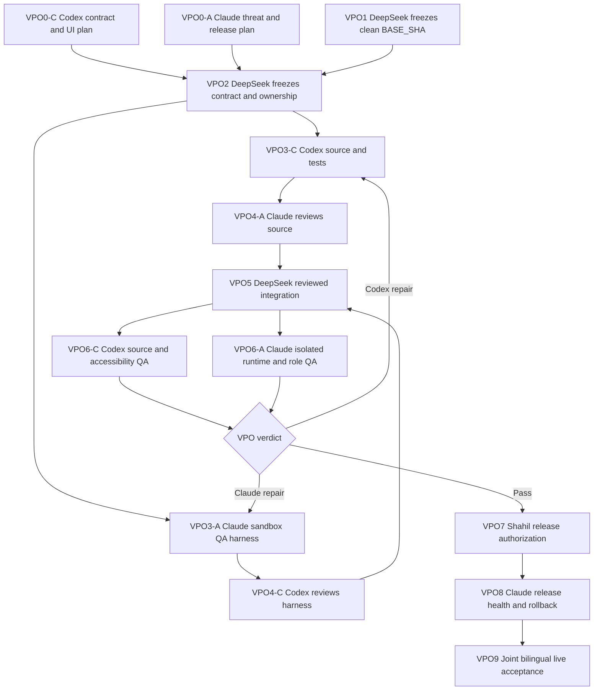

# MAB Vendor Purchase Order detail — parallel DeepSeek harness graph

- Date: 2026-08-25
- Product authority: Shahil
- Coordinator and integration owner: DeepSeek Harness
- Application, contract, and source-test owner: Codex
- Runtime, release, rollback, and live-QA owner: Claude Code
- Status: **VPO0 plans complete; VPO1 blocked until the active quotation/Supplier-RFQ and UI6 lanes have one clean integrated base SHA**
- Visual target: `Screenshot 2026-08-08 at 1.18.07 AM.png`

## Outcome

Build a native PxD Vendor Purchase Order detail page that lets an MAB operator understand one
order, its supplier, approval state, document evidence, and operating progress without re-keying
or inventing data.

The screenshot is the visual target, not a source of business data. Names, amounts, dates, owner,
risk, order lines, statuses, and progress must come from authoritative PxD records or render an
explicit **Not recorded** state.

## Product boundary

The page must provide:

1. a source-backed PO header, status, total, required date, owner, and version;
2. an MAB progress rail derived from the accepted workflow contract;
3. a structured order-lines table with exact arithmetic and evidence provenance;
4. a supplier identity and compliance panel with native drill-through;
5. a human approval panel backed by the audited approval commands;
6. evidence, audit, and related-case links;
7. English and Arabic, true RTL, keyboard and screen-reader support, 44 px targets, and usable
   native 200% zoom; and
8. loading, empty, partial-evidence, unavailable, conflict, timeout/unknown-result, error,
   no-permission, and not-found states.

The page must not:

- copy the mockup's fictional Al Noor supplier, Omar owner, four order lines, dates, or amounts;
- invent a parallel purchase-order state machine;
- show payment as a completed case stage without a verified `cashMovement` record;
- infer a vendor `Verified` badge from company existence or CR/VAT presence;
- update native records directly when an audited command boundary is required;
- approve on behalf of a human, finalize financial documents, alter compliance, send email,
  enable OCR, or mutate live pilot data from a source node; or
- publish, install, or deploy before Shahil records separate release authority.

## Authoritative workflow mapping

The mockup contains nine display steps. PxD will not copy those as a new state machine. The primary
rail uses the seven accepted MAB operating steps, derived from `PASHX_MAB_WORKFLOW_DOCUMENT_RULES`:

| Step | Case stage | Required operating evidence |
|---|---|---|
| Client RFQ | `intake` | finalized `customerRfq` |
| Supplier sourcing | `sourcing` | `supplierRfq` plus source-backed `vendorQuote` evidence |
| Client quote | `quoted` | finalized `customerQuote` |
| Client PO | `customer-order` | finalized `customerPurchaseOrder` and client-order verification |
| Vendor PO | `vendor-order` | finalized `vendorPurchaseOrder` and internal procurement approval |
| Delivery | `delivery` | finalized `deliveryNote`; `vendorInvoice` is supporting evidence |
| Client invoice | `invoicing` | finalized `customerInvoice`; finance posting approval precedes close |

Closed and cancelled remain terminal states. Internal approval, supplier confirmation, receipt,
vendor invoice, and verified payment appear in a separate supporting-evidence strip. Supplier
confirmation stays **Not recorded** until a contract exists; receipt requires actual delivery
evidence; payment requires a verified `cashMovement`. Their completion does not silently advance
the case stage.

## Field provenance and contract gaps

| UI value or action | Current authority | VPO2 decision required |
|---|---|---|
| PO reference | `commercialDocument.name` | None. |
| Document type/state | `documentType`, `lifecycleStatus` | None. |
| Case/project | `procurementCaseRecordId` and bounded case read model | Define the exact project display field; do not infer. |
| Supplier | `supplierRecordId` and Company metadata | None for identity; enforce workspace scoping. |
| Issue date/currency/total | `issueDate`, `currencyCode`, `totalAmount` | Freeze integer-micros arithmetic and VAT presentation. |
| Required by | Not authoritative today | Add an approved field or render **Not recorded**. Do not derive silently. |
| Owner | case `ownerRecordId` if it resolves to a workspace member | Freeze fallback and no-owner state. |
| Draft version | `aggregateVersion` | Freeze user-facing copy and concurrency semantics. |
| Payment terms/lead time/validity | existing Commercial Document fields | Display stored values only. |
| Supplier VAT/CR | Company metadata | Display stored values and native source link. |
| Supplier risk | no proven PO-level risk authority | Add stored compliance projection or render **Not recorded**. |
| Order lines | `documentLine` currently has only `name` | Extend with document link, position, description/specification, quantity, unit, unit price, amount, and currency. |
| Send for approval | generic OC3 approval commands exist | Freeze a PO-specific action code, payload digest, role permission, CAS, idempotency, and audit contract. |
| Edit details | no approved audited PO-update command proven | Initially open the native record read view, or approve a dedicated command before editing. |
| Download draft | no deterministic renderer proven | Show unavailable until a local, reproducible document renderer is accepted. |

All money is stored and calculated with integer micros. The page must reject or mark
incomparable mixed currencies, mismatched line sums, invalid quantities, and incomplete VAT data.

## Real-data acceptance anchor

The only existing record approved as a read-only acceptance anchor is `MAB-PO-2026-4141` for
Steel and Metal Solution Trading Company. Current reviewed source evidence reports 27 source lines,
subtotal SAR 110,908.00, VAT SAR 16,636.20, total SAR 127,544.20, 100% advance, DDP Dammam 2nd
Industrial, and Ex-Stock availability.

Those values must be independently revalidated during VPO2. The 27 lines may not be imported or
shown as structured facts until the human-reviewed document correction ledger marks each line
verified. Until then, the page must preserve the source document link and show the structured line
table as incomplete or **Not recorded**. The accepted record is never used for mutation tests.

## Clean-base and sandbox protocol

The primary checkout is dirty with an active Supplier-RFQ/server lane and a package-version edit.
It is not a valid development or release base.

DeepSeek must wait until the following accepted work is represented by one clean commit graph:

- the completed Quotation & Vendor Comparison/Supplier-RFQ lane;
- the accepted MAB workflow-pipeline follow-up;
- UI6 verified cash movement if it is included in this release; and
- no unresolved release/version conflict.

DeepSeek then records `BASE_SHA=<40-character commit>` and creates exactly these sibling worktrees:

| Lane | Suggested branch | Suggested worktree | Write authority |
|---|---|---|---|
| Integration | `deepseek/vpo-integration` | `../twenty-vpo-integration` | DeepSeek applies reviewed commits and resolves mechanical conflicts only. |
| Codex source | `deepseek/vpo-codex` | `../twenty-vpo-codex` | Approved contract, app, bounded server capability, source tests, and source evidence. |
| Claude QA | `deepseek/vpo-claude` | `../twenty-vpo-claude` | Sandbox harness, fixture inventory, release checklist, rollback, and runtime evidence. |

Each lane gets distinct environment files, dependency/cache boundaries, container project names,
ports, and browser profiles. Secrets, tokens, pilot credentials, database dumps, and uncommitted
patches are never copied between lanes. Handoffs use reviewed commit SHAs and evidence files.

## Parallel execution graph



## Node contracts

| Node | Owner | Deliverable | Exit condition |
|---|---|---|---|
| **VPO0-C** | Codex | Read model, provenance matrix, command contract, UI states, accessibility rules, file allowlist. | Read-only plan returned; gaps explicit. **Complete.** |
| **VPO0-A** | Claude | Threat model, role/runtime matrix, fixture cleanup, release and rollback procedure. | Read-only plan returned; live boundary explicit. **Complete.** |
| **VPO1** | DeepSeek | Clean integrated base and three isolated worktrees. | Exact SHA verified; every worktree clean; no active-lane overlap. |
| **VPO2** | DeepSeek + Shahil | Frozen schema, state/evidence mapping, PO approval semantics, action availability, role matrix, UI acceptance, and file ownership. | No unresolved product rule or provenance gap. Material new rules explicitly approved. |
| **VPO3-C** | Codex | Contract/model migration, bounded case-scoped read adapter, native page, bilingual copy, audited actions, tests, evidence. | Narrow tests, package suites, lint, typecheck, build, and diff check pass. No live mutation/version bump. |
| **VPO3-A** | Claude | Sanitized fixture creator/cleaner, REST/DB assertions, role matrix, browser checklist, release evidence template. | Harness proves IDs, cleanup, bounded retries, and zero live access. |
| **VPO4-A** | Claude | Adversarial source review. | Permission, isolation, amounts, idempotency, CAS, audit, provenance, and unsafe-action review returns PASS. |
| **VPO4-C** | Codex | Harness safety review. | No destructive cleanup, false evidence, secret leakage, unbounded retry, or cross-workspace operation. |
| **VPO5** | DeepSeek | Reviewed integration commit. | Only PASS commits cherry-picked; conflicts returned to owner unless purely mechanical. |
| **VPO6-C** | Codex | Full source/accessibility verification. | Contract/app/server tests, official build, EN/AR/RTL/a11y static matrix pass. |
| **VPO6-A** | Claude | Isolated runtime/role/transaction verification. | Sanitized matrix passes; fixtures removed with REST and DB absence proof. No pilot mutation. |
| **VPO7** | Shahil | Separate publish/install and bounded live-fixture authorization. | Exact authority recorded after reviewing VPO6. |
| **VPO8** | Claude | Version resolution, publish/install, metadata and health verification, rollback evidence. | App identity/version/source/build/host digests recorded; health and rollback pass. |
| **VPO9** | Codex + Claude | Joint live acceptance against real read-only PO and one disposable fixture family. | Data, commands, roles, evidence, bilingual UI, accessibility, cleanup, and residuals recorded. |

## VPO2 decisions to freeze before source work

1. `documentLine` relation and field schema, validation limits, deletion semantics, and migration.
2. Whether `requiredBy` is stored on the document, case, or not supported in this release.
3. Whether supplier risk has an authoritative compliance projection or remains unavailable.
4. PO-specific approval action code and canonical payload digest.
5. Which roles may request, decide, cancel, and edit; assigned-approver enforcement.
6. Whether the first release supports a command-based PO edit or native read-only drill-through.
7. Whether deterministic local draft rendering is in scope; otherwise disable the download action.
8. How confirmed, receipt, and payment evidence appear without becoming parallel case stages.
9. The human-reviewed correction-ledger gate for the real 27 PO lines.

## Proposed source ownership

Codex may modify only VPO2-approved files under:

- `packages/pashx-mab-contract/` for typed schema, command payloads, errors, and tests;
- `packages/twenty-apps/pashx-mab/` for objects, roles, page/front component, copy, read model, and tests;
- `packages/twenty-server/src/modules/pashx-mab/` and its integration tests only when a failing
  contract proves an app-only implementation is insufficient; and
- `docs/execution/evidence/` for source evidence.

Claude may modify only the VPO2-approved harness and release-evidence paths. Claude does not edit
Codex-owned feature files. DeepSeek does not redesign source during integration.

Any unexpected `package.json` version change, manifest identity change, infrastructure file,
mailbox/OCR code, or unrelated dirty file automatically blocks integration.

## Required source and runtime tests

### Data and isolation

- document/case/supplier/line records remain in one workspace and one case boundary;
- every displayed value matches its source field and source link;
- line arithmetic, subtotal, VAT, and total use integer micros;
- mixed currencies and inconsistent totals fail closed;
- missing required date, owner, risk, lines, attachment, or evidence is explicit;
- the real PO projection contains no fictional mockup values.

### Commands

- request success creates exactly one pending approval and one audit event;
- identical idempotency replay creates no duplicate;
- changed payload with the same key returns the typed 409;
- stale version returns `RECORD_CONFLICT` with no partial write;
- approve, reject, and cancel preserve actor, note, timestamps, permission, and audit behavior;
- unauthorized requester/approver and cross-user/cross-workspace attempts fail closed;
- timeout/unknown result permits a safe identical retry.

### UI and accessibility

- ready, loading, empty, partial, unavailable, pending, approved, rejected, cancelled, conflict,
  validation-error, timeout, error, not-found, and no-permission states;
- semantic page landmarks, heading order, data-table headers, status announcements, and named
  controls;
- visible focus, logical physical Tab order, 44 px targets, reduced motion, and no color-only state;
- meaningful Arabic translation, full RTL mirroring, and LTR isolation for references and SAR;
- exact native 200% zoom has no clipped controls, missing data, or page-level horizontal scroll;
- all drill-through links open the exact native case, supplier, approval, evidence, and audit record.

## Sanitized live-QA fixture rule

The real `MAB-PO-2026-4141` is read-only. Mutation QA uses exactly one fixture family prefixed
`VPO-QA-DISPOSABLE-<run-id>` containing one fictional supplier, one case, one PO, verified test
lines, and only the approval records required by the matrix. Every UUID is captured immediately.

Cleanup uses captured IDs, never names or broad filters. Claude verifies REST 404, SQL zero active
rows, and pre/post counts. The harness may not email a supplier, finalize real evidence, change
compliance, create cash evidence, or touch the accepted PO.

Assigned-approver and cross-user tests require a second real credentialed identity. If that
identity is unavailable, those rows remain **BLOCKED**, never inferred from source behavior.

## Release and rollback boundary

At VPO8, Claude resolves the next unused version at runtime; it must not assume `0.2.15` while
other lanes are active. App-only changes use private publish/install. Any server/renderer delta
requires separate host-build/deploy authority, an immutable image digest, and prior-digest
rollback.

Claude records the application universal identifier, workspace, source SHA, package version,
artifact/manifest checksum, active host digest, metadata relations, health before/after, container
state, recent logs, and rollback target. Release rolls back immediately for identity mismatch,
duplicate metadata, unauthorized write, amount mismatch, broken idempotency/CAS/audit, missing
evidence, persistent health failure, or secret exposure.

## Repair loop

For every node DeepSeek runs:

1. **Observe** the frozen graph, ledger, base SHA, diff, tests, and evidence.
2. **Hypothesize** one smallest failure mechanism.
3. **Assign** one owner, file allowlist, forbidden actions, and exit command.
4. **Execute** in the owner's isolated worktree.
5. **Verify** the narrow test, package suite, lint/typecheck, official build, then bounded runtime
   checks when authorized.
6. **Classify** `PASS`, `CODEX_REPAIR`, `CLAUDE_REPAIR`, `USER_DECISION`, or `BLOCKED`.
7. **Record** the verdict, evidence, changed files, fixture inventory, and next owner in shared
   context before opening the next node.

The same evidence-backed failure may loop at most three times. On the third recurrence, DeepSeek
records `BLOCKED`, the smallest failing test, the owning lane, and the decision needed. It must not
cross ownership or silently weaken acceptance.

## Machine-readable handoff

Every node ends with:

```text
NODE: VPOx-y
BASE_SHA: <40-character SHA>
STATUS: PASS | REPAIR | BLOCKED
COMMITS: <SHA list or none>
FILES_CHANGED: <paths or none>
TESTS: <command => result>
FIXTURES_CREATED: <IDs or none>
FIXTURES_CLEANED: <IDs plus absence proof or none>
LIVE_MUTATION: none | bounded disposable IDs
VERSION: <released version or none>
SOURCE_DIGEST: <SHA or none>
MANIFEST_SHASUM: <SHA or none>
HOST_DIGEST: <digest or none>
ROLLBACK: <app version and/or host digest or none>
RISKS: <bounded list>
NEXT_OWNER: <DeepSeek | Codex | Claude | Shahil>
```

Missing base SHA, unexpected live mutation, secret exposure, unrelated changed files, fabricated
data, absent cleanup proof, or publish/install without authority is an automatic `BLOCKED` verdict.

## DeepSeek Harness instruction — paste verbatim

```text
Coordinate the PxD MAB Vendor Purchase Order detail track defined in
docs/execution/2026-08-25 - vendor-purchase-order detail parallel harness graph.md.

You are the coordinator and integration owner, not the feature author. Read the latest shared
context first. Do not use the dirty primary checkout as a source or release base. Wait until the
accepted quotation/Supplier-RFQ, workflow-pipeline follow-up, and any included UI6 work have one
clean commit graph; record that exact 40-character BASE_SHA.

Create isolated DeepSeek integration, Codex source, and Claude QA worktrees from exactly BASE_SHA.
Start Codex VPO3-C and Claude VPO3-A concurrently only after VPO2 freezes field provenance,
document-line schema, approval semantics, role permissions, action availability, workflow/evidence
mapping, file ownership, and acceptance. Enforce the file boundaries in this graph.

Claude must adversarially review Codex source. Codex must review Claude's harness safety. Cherry-pick
only PASS commits into the integration lane. Run VPO6-C and VPO6-A in parallel. Route source defects
only to Codex and harness/runtime defects only to Claude. Stop after three repetitions of the same
failure and record the smallest blocker.

Never copy the screenshot's fictional values. Use MAB-PO-2026-4141 only for read-only source
verification, and do not import its 27 lines until the human correction ledger verifies them.
Payment is verified cash evidence, not a case stage. Missing data renders Not recorded.

Do not publish, install, deploy, access email/OCR, use pilot credentials, alter infrastructure, or
mutate live data before VPO7. VPO7 requires Shahil's separate explicit authority. Append every node
verdict, commit, test, fixture ID, cleanup proof, risk, and next owner to the shared context. Never
claim an agent is running or a node is complete without the machine-readable handoff block.
```

## Codex assignment — paste verbatim after VPO2

```text
Implement VPO3-C in the isolated Codex worktree from the exact VPO BASE_SHA. Read the frozen VPO2
contract and change only its file allowlist. Build the case-scoped Vendor PO read model, approved
schema/commands, native PxD page, bilingual/RTL copy, honest runtime states, evidence links, and
tests. Every value must be source-backed or Not recorded. Reuse audited approval/idempotency/CAS
boundaries; do not write native financial state directly.

Do not use mockup values, import unverified MAB-PO-2026-4141 lines, bump the app version, publish,
install, deploy, touch infrastructure/email/OCR, or mutate the pilot. Run narrow tests first, then
contract/app/server suites, lint, typecheck, official app build, and git diff --check. Commit only
the approved source/evidence files and return the machine-readable handoff.
```

## Claude assignment — paste verbatim after VPO2

```text
Build VPO3-A in the isolated Claude QA worktree from the exact VPO BASE_SHA. Change only the frozen
harness/evidence file allowlist. Implement sanitized fixture setup and captured-ID cleanup, REST/DB
assertions, role/permission and transaction matrices, browser/accessibility checklist, release
evidence template, health checks, and rollback procedure. Do not implement Codex-owned app source.

Do not access or mutate the pilot, publish/install/deploy, use live credentials, touch
infrastructure/email/OCR, or assume a package version. Review Codex VPO3-C adversarially when
assigned, then return the machine-readable handoff with smallest reproducible failures.
```

## Current verdict

- `VPO0-C`: **PASS**, read-only Codex inspection complete.
- `VPO0-A`: **PASS**, read-only Claude inspection complete.
- `VPO1`: **BLOCKED by sequencing**, not by missing design. The primary checkout is dirty and the
  clean base must include the accepted work named above.
- Next owner: **DeepSeek Harness**, after those lanes publish one clean accepted base SHA.
